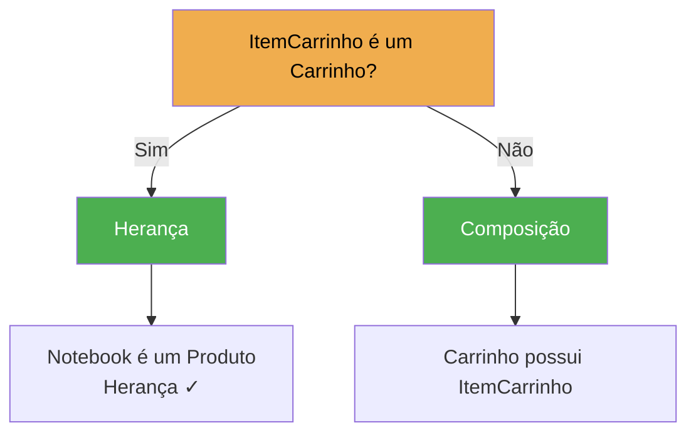
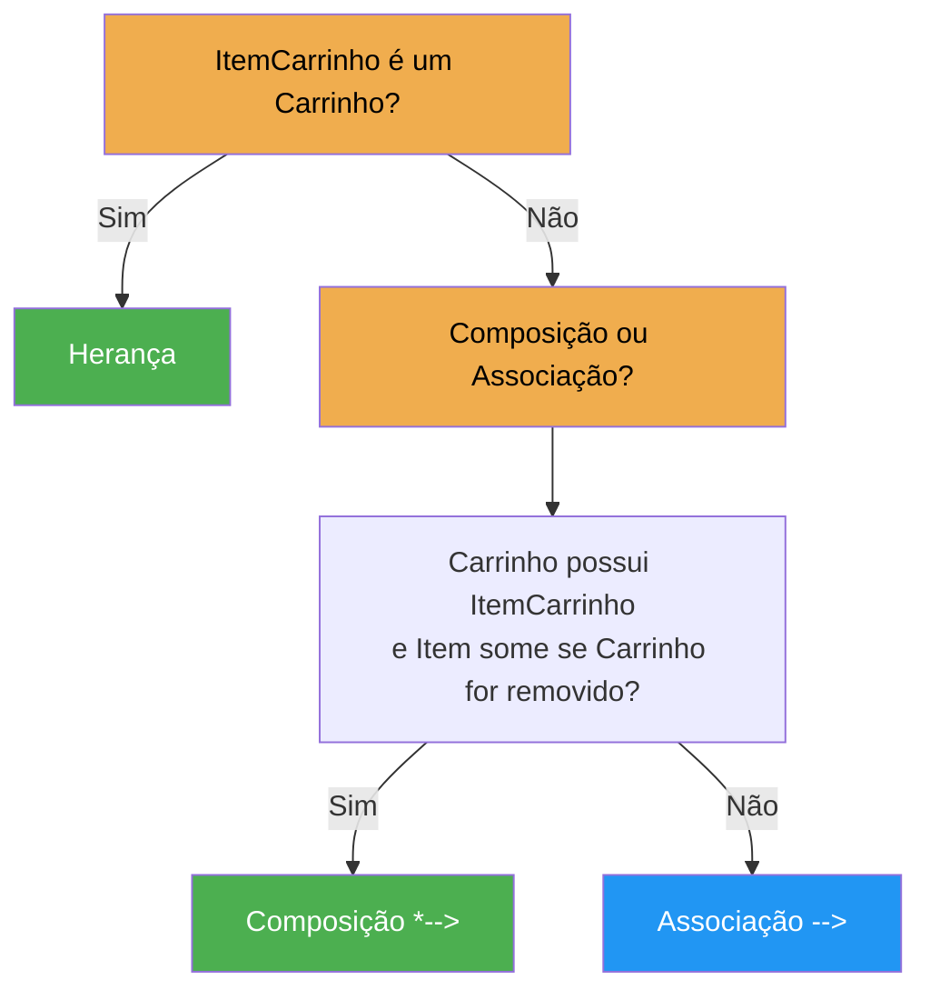
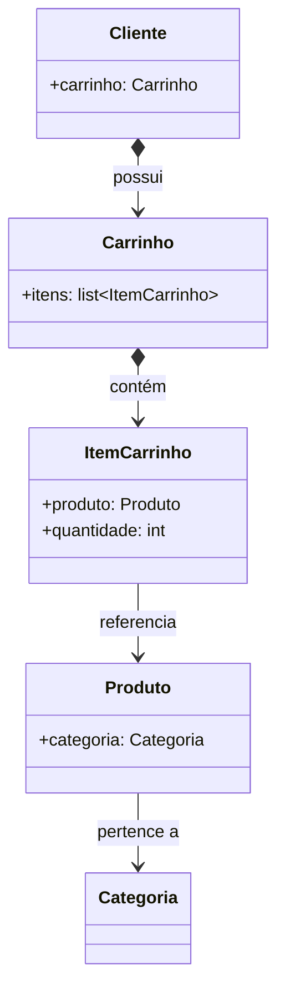

# Composição ou herança?

No arquivo anterior modelamos as primeiras entidades. Observamos que `Carrinho` contém `ItemCarrinho`, e que `ItemCarrinho` referencia `Produto`. Mas que tipo de relacionamento é cada um desses? É aqui que precisamos diferenciar **composição** de **herança**.

Observe as classes `Carrinho` e `ItemCarrinho`. Seria correto fazer?

```python
class ItemCarrinho(Carrinho):  # ERRADO!
    ...
```

**Não.** Um item do carrinho **não é um carrinho**. Ele **faz parte** de um carrinho. Temos uma relação de **composição**, e não de herança.

??? danger "Erro comum entre iniciantes"

    Este é um erro muito comum entre iniciantes. Uma regra prática bastante utilizada é perguntar:

    > Podemos dizer que "ItemCarrinho **é um** Carrinho"?

    **Não.** Então herança não faz sentido.

    Agora pergunte:

    > Um Carrinho **possui vários** ItemCarrinho?

    **Sim.** Logo, composição representa melhor essa relação.

---

## Herança vs. Composição



### Os 4 tipos de relacionamento em UML

| Símbolo | Nome | Significado |
|---------|------|-------------|
| `-->` | **Associação** | A classe **conhece/referencia** a outra, mas ambas existem independentemente |
| `o-->` | **Agregação** | A classe **possui** a outra, mas a parte **pode existir sem o todo** |
| `*-->` | **Composição** | A classe **é composta por** / **contém** a outra. A parte **não existe sem o todo** |
| `<|--` | **Herança** | A subclasse **é um** tipo da superclasse |

### Exemplos práticos no E-Commerce

| Situação | Pergunta | Resposta | Relação | Símbolo UML |
|----------|----------|----------|---------|-------------|
| `ItemCarrinho` e `Carrinho` | Item é um Carrinho? | Não | Composição | `*-->` |
| `ItemCarrinho` e `Produto` | ItemCarrinho é um Produto? | Não | Associação | `-->` |
| `Categoria` e `Produto` | Categoria é um Produto? | Não | Associação | `-->` |
| `Carrinho` e `Cliente` | Carrinho é um Cliente? | Não | Composição | `*-->` |
| `ProdutoFisico` e `Produto` | ProdutoFisico é um Produto? | Sim | Herança | `<|--` |
| `ProdutoDigital` e `Produto` | ProdutoDigital é um Produto? | Sim | Herança | `<|--` |

### Identificando na prática



---

## Composição no nosso modelo

Nosso modelo atual utiliza composição em diversos pontos:



Note que usamos composição (losango preenchido) onde a relação é **todo-parte** (Carrinho contém Itens, Cliente possui Carrinho), e associação simples onde é apenas **referência** (ItemCarrinho referencia Produto, mas não o contém).

!!! tip "Regra prática para o curso"

    Durante este curso, **composição será utilizada muito mais frequentemente do que herança**, refletindo uma prática comum em projetos modernos. A herança será reservada para casos onde realmente existe uma relação "é um" clara e benéfica para o projeto.

---

## Discussão de projeto

Antes de escrever qualquer código, responda às perguntas abaixo. Não existe problema em errar. Nosso objetivo é justamente aprender a pensar sobre projeto.

??? question "1. Quem deveria calcular o subtotal de um item do carrinho?"

    - `Produto`?
    - `Carrinho`?
    - `ItemCarrinho`?

    **Resposta:** O `ItemCarrinho` conhece seu produto, sua quantidade e o preço no momento da compra. Ele possui todas as informações necessárias para calcular `preco * quantidade`. Essa responsabilidade é naturalmente dele.

??? question "2. Quem deveria calcular o valor total da compra?"

    - `Cliente`?
    - `Produto`?
    - `Carrinho`?
    - `Categoria`?

    **Resposta:** O `Carrinho` conhece todos os seus itens. Para calcular o total, ele pode iterar sobre os itens e somar os subtotais. Essa é uma responsabilidade clara do carrinho.

??? question "3. Quem deveria conhecer a quantidade de um produto comprado?"

    - `Produto`?
    - `Cliente`?
    - `ItemCarrinho`?

    **Resposta:** O `ItemCarrinho`. A quantidade é uma informação intrínseca do item no carrinho. O `Produto` não sabe quantas unidades foram adicionadas — ele apenas define o preço unitário.

??? question "4. Um cliente pode possuir mais de um carrinho?"

    Pense em situações como:
    
    - Carrinho salvo para depois
    - Compra recorrente
    - Listas de desejos
    - Múltiplas sessões

    **Reflexão:** Nossa modelagem atual prevê **um** carrinho por cliente. Mas será que isso será suficiente? Será que nossa modelagem precisará evoluir futuramente? Essa é exatamente a natureza iterativa do design de software.

---

## O que faremos a seguir

Agora que entendemos melhor o domínio e revisamos os conceitos fundamentais, começaremos finalmente a escrever código. Mas faremos isso com uma preocupação constante: **cada classe deverá possuir uma responsabilidade clara**.

Não criaremos classes apenas porque "parece necessário". Cada atributo, método e relacionamento será justificado com base no domínio do problema e nos princípios da Programação Orientada a Objetos.

```python
# O que está por vir...
class Produto:
    def __init__(self, nome: str, preco: float, categoria: "Categoria"):
        self.nome = nome
        self.preco = preco
        self.categoria = categoria
        self.disponivel = True

    def aplicar_desconto(self, percentual: float) -> None:
        if not 0 <= percentual <= 100:
            raise ValueError("Percentual deve estar entre 0 e 100")
        self.preco -= self.preco * (percentual / 100)
```

---

## Aplicando ao Projeto Financeiro

No E-Commerce, temos `Carrinho *--> ItemCarrinho` (composição) e `ItemCarrinho --> Produto` (associação). Identifique no sistema financeiro quais relacionamentos seriam composição e quais seriam associação. Por exemplo: uma `Carteira` **contém** `Investimentos`? Ou apenas **referencia**? Por quê?

---

Nas próximas aulas iniciaremos a implementação completa do nosso sistema.
