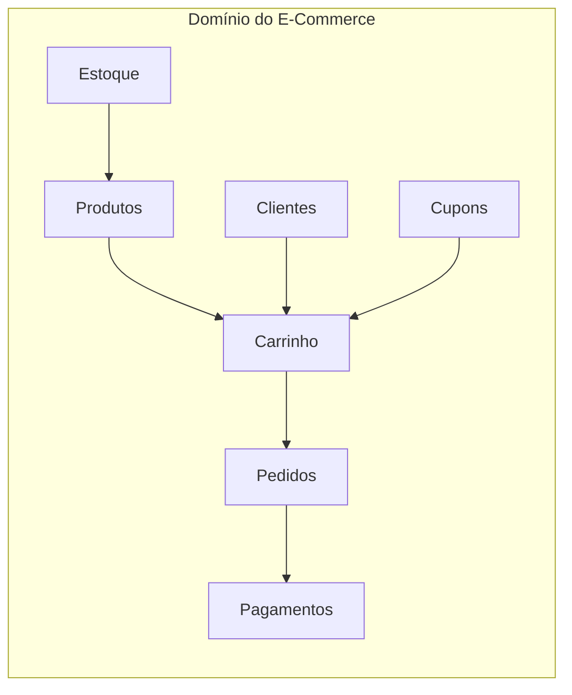
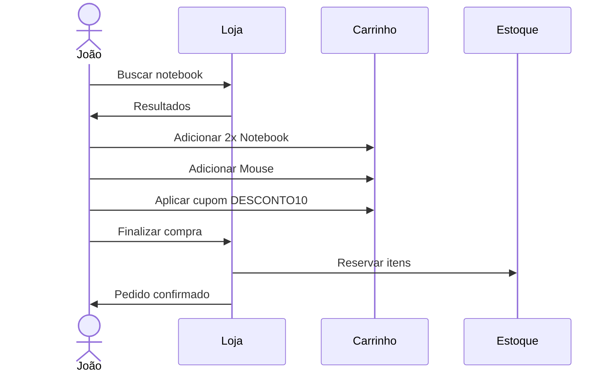

# Conhecendo o domínio do problema

Até este momento discutimos como o curso será conduzido e por que aprender a projetar software é mais importante do que simplesmente aprender uma linguagem de programação. Agora chegou o momento de iniciar o desenvolvimento do nosso sistema.

Entretanto, **ainda não escreveremos código**. Nossa primeira tarefa será compreender o problema que estamos tentando resolver.

!!! info "Análise de domínio"

    Essa etapa recebe diversos nomes na Engenharia de Software: levantamento de requisitos, análise de domínio ou modelagem do domínio. Independentemente do nome utilizado, a ideia é a mesma: **entender o problema antes de propor uma solução**.

---

## Um erro muito comum

Imagine que alguém diga:

> "Precisamos desenvolver um sistema para uma loja virtual."

Um desenvolvedor iniciante normalmente abre a IDE e começa a criar classes:

```python
class Produto:
    pass


class Cliente:
    pass


class Pedido:
    pass
```

Algumas horas depois existem dezenas de classes, centenas de linhas de código e... nenhuma certeza de que o sistema está indo na direção correta. O problema é que **criar classes não significa compreender o domínio**.

!!! warning "A pergunta certa"

    Antes de perguntar **"como implementar?"**, devemos perguntar: **"como esse negócio funciona?"** Essa mudança de perspectiva é um dos grandes diferenciais entre um programador e um engenheiro de software.

---

## O que é um domínio?

Chamamos de **domínio** o conjunto de regras, conceitos e processos relacionados ao problema que estamos tentando resolver.

No nosso caso, o domínio é o funcionamento de um comércio eletrônico.



Um E-Commerce possui diversas regras. Por exemplo:

- Produtos possuem preço
- Produtos pertencem a categorias
- Clientes realizam compras
- Clientes adicionam produtos ao carrinho
- Pedidos são pagos
- Pedidos podem ser cancelados
- Alguns produtos podem estar sem estoque
- Cupons concedem descontos
- Formas de pagamento possuem regras diferentes

!!! tip "Regras de negócio vs. tecnologia"

    Perceba que nenhuma dessas afirmações fala sobre Python. Nenhuma delas fala sobre classes. Nenhuma delas fala sobre banco de dados. **São regras do negócio.** Essas regras continuarão existindo mesmo que o sistema seja reescrito em outra linguagem daqui a dez anos. Esse é justamente o motivo pelo qual dizemos que **o domínio deve guiar o software**, e não o contrário.

---

## Nossa primeira pergunta

Sempre que iniciamos um novo sistema, uma boa pergunta é:

> **Quais são os objetos que existem nesse domínio?**

Pensando rapidamente, podemos listar:

- Produto
- Categoria
- Cliente
- Carrinho
- Item do Carrinho
- Pedido
- Item do Pedido
- Cupom
- Pagamento
- Estoque

Essa lista não está pronta. Provavelmente ela mudará durante o desenvolvimento. Isso é esperado. Projetar software é um processo **iterativo**.

---

## Uma observação importante

Muitos alunos imaginam que basta transformar cada substantivo em uma classe. Infelizmente isso não funciona.

Considere a frase:

> "O cliente compra um produto utilizando um cartão de crédito."

Temos os substantivos: **Cliente**, **Produto**, **Cartão**, **Crédito**. Será que todos devem virar classes? Talvez. Talvez não. Depende do domínio.

Às vezes um conceito importante pode ser representado apenas por um atributo. Em outros casos um simples atributo evolui para uma classe inteira.

??? question "Cartão de crédito é classe ou atributo?"

    Em um sistema financeiro, `CartaoDeCredito` provavelmente seria uma classe com diversos atributos e comportamentos (limite, fatura, juros). Em um sistema simples de E-Commerce, talvez seja apenas um atributo do pagamento. **Modelagem envolve decisões, e não regras rígidas.**

---

## Vamos imaginar uma compra

João entra em uma loja virtual. Ele procura um notebook. Encontra um produto. Adiciona duas unidades ao carrinho. Depois adiciona um mouse. Aplica um cupom de desconto. Escolhe pagar com cartão de crédito. Finaliza a compra. Dias depois recebe os produtos.



Agora pense: quais objetos participaram dessa história? Provavelmente você respondeu algo semelhante a:

- Cliente
- Produto
- Carrinho
- ItemCarrinho
- Cupom
- Pedido
- Pagamento

Perceba que esses objetos surgiram naturalmente da narrativa. Essa é uma excelente técnica para descobrir entidades de um domínio.
