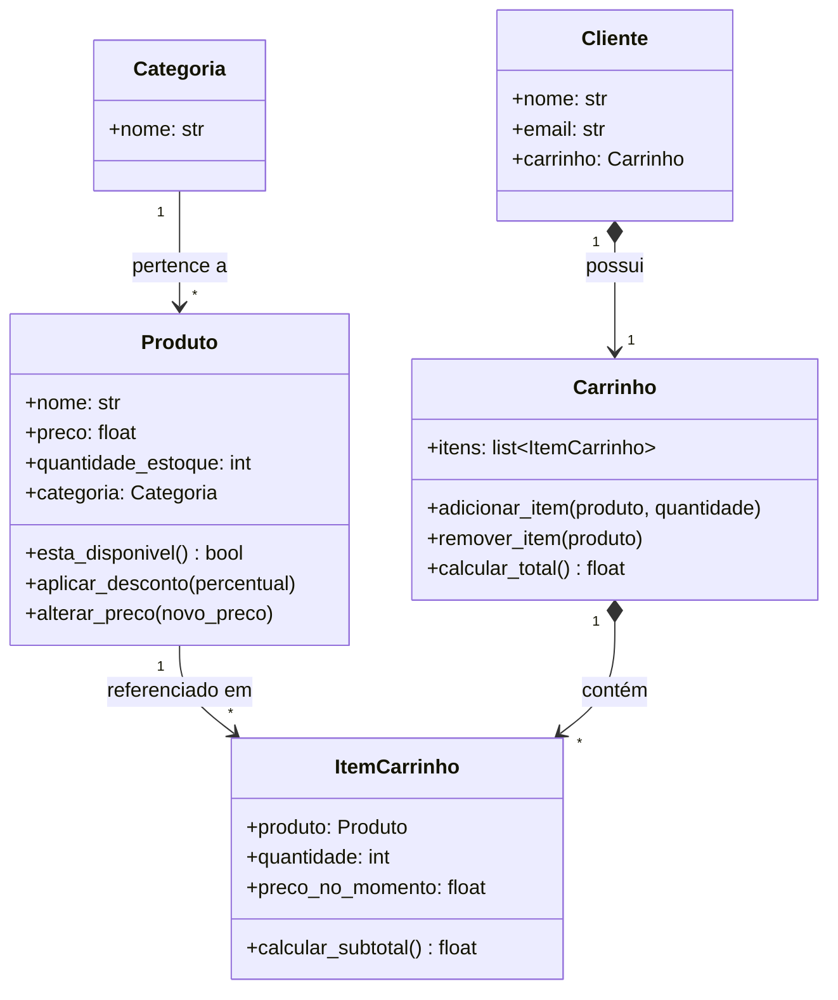

# Primeiras entidades do modelo

## Primeira versão do nosso modelo

Nossa primeira versão será propositalmente simples. Teremos apenas cinco classes. Ainda não teremos pedidos, estoque, pagamentos, cupons ou notas fiscais. Essas funcionalidades serão adicionadas nas próximas aulas.



!!! info "Lendo os símbolos do diagrama"

    | Símbolo | Nome | Significado | Exemplo no modelo |
    |---------|------|-------------|-------------------|
    | `-->` | **Associação** | A classe **conhece** a outra, mas ambas existem independentemente | `ItemCarrinho` → `Produto` (se o carrinho for removido, o produto continua) |
    | `*-->` | **Composição** | A classe **contém** a outra; a parte **não existe sem o todo** | `Carrinho` ◆→ `ItemCarrinho` (sem carrinho, não faz sentido existir o item) |
    | `<|--` | **Herança** | A subclasse **é um** tipo da superclasse | `ProdutoFisico` ─▷ `Produto` |

    Identifique no diagrama: `Categoria --> Produto` é associação (produto existe sem categoria? Sim). `Carrinho *--> ItemCarrinho` é composição (item existe sem carrinho? Não). Essa distinção será importante nas próximas aulas.

!!! info "Lições importantes"

    É importante aprender uma lição logo no início: **software evolui**. Não existe obrigação de modelar todo o sistema antes de começar. Modelaremos apenas o suficiente para resolver o problema atual.

---

## Um produto conhece seu carrinho?

Imagine um produto chamado "Notebook Gamer". Ele precisa saber em quais carrinhos ele foi colocado?

**Não.** O produto existe independentemente dos clientes. Logo, ele não deve armazenar uma lista de carrinhos. Essa decisão reduz o **acoplamento** entre as classes.

```python
# Correto: Produto não sabe quem o colocou no carrinho
class Produto:
    def __init__(self, nome, preco, quantidade_estoque, categoria):
        self.nome = nome
        self.preco = preco
        self.quantidade_estoque = quantidade_estoque
        self.categoria = categoria  # Sabe sua categoria, mas não seus carrinhos

    def esta_disponivel(self):
        return self.quantidade_estoque > 0
```

---

## Um carrinho conhece seus produtos?

**Sim.** O carrinho precisa saber quais itens foram adicionados. Portanto, faz sentido que ele possua uma coleção de itens. Essa é uma relação natural do domínio.

```python
class Carrinho:
    def __init__(self):
        self.itens = []  # O carrinho conhece seus itens

    def adicionar_item(self, produto, quantidade):
        ...
```

---

## Produto ou Item do Carrinho?

Essa costuma ser uma dúvida muito comum. Por que não armazenar diretamente uma lista de produtos dentro do carrinho?

```python
class Carrinho:

    def __init__(self):
        self.produtos = []  # Problema: como representar quantidade?
```

Parece funcionar, mas imagine que o cliente adicione **três unidades do mesmo produto**. Como representaríamos a quantidade? Talvez repetindo o produto três vezes. Isso gera diversos problemas.

Além disso, imagine que seja necessário registrar o preço do produto **no momento da compra**. E se o preço mudar amanhã?

Percebemos então que existe um **novo conceito** no domínio. Não é apenas um produto. É um **produto dentro do carrinho**. Esse conceito possui informações próprias:

- Produto
- Quantidade
- Preço no momento da inclusão
- Subtotal

Portanto, ele merece uma classe própria: **ItemCarrinho**.

!!! tip "Princípio importante"

    Quando um relacionamento começa a possuir informações próprias, ele normalmente merece se transformar em um **objeto**.

---

## Exercício de modelagem

Antes de prosseguir, tente identificar você mesmo os conceitos envolvidos na seguinte narrativa:

> Maria entrou em uma loja virtual, adicionou dois livros ao carrinho, depois removeu um deles, aplicou um cupom de 10% e finalizou a compra pagando com boleto bancário.

??? question "Quais entidades você identificou?"

    - Cliente (Maria)
    - Produto (livros)
    - Carrinho
    - ItemCarrinho (cada livro com sua quantidade)
    - Cupom (desconto de 10%)
    - Pedido (compra finalizada)
    - Pagamento (boleto bancário)

    Perceba como a mesma estrutura começa a surgir naturalmente, independentemente dos detalhes específicos da história.
