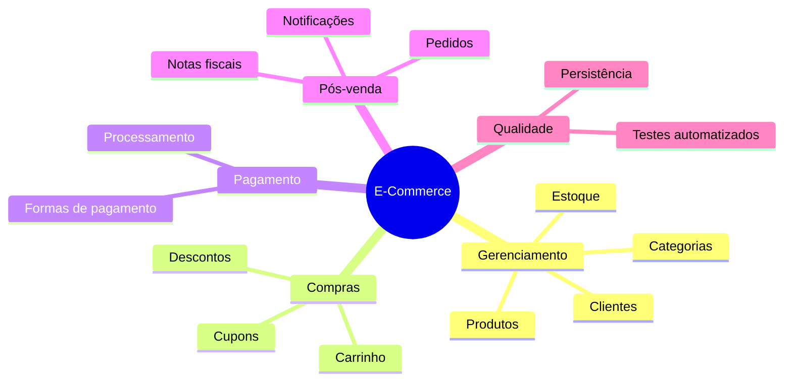
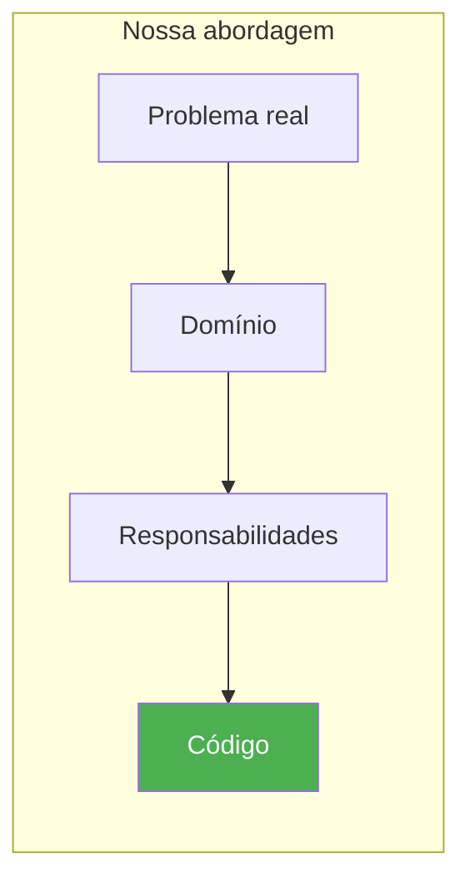
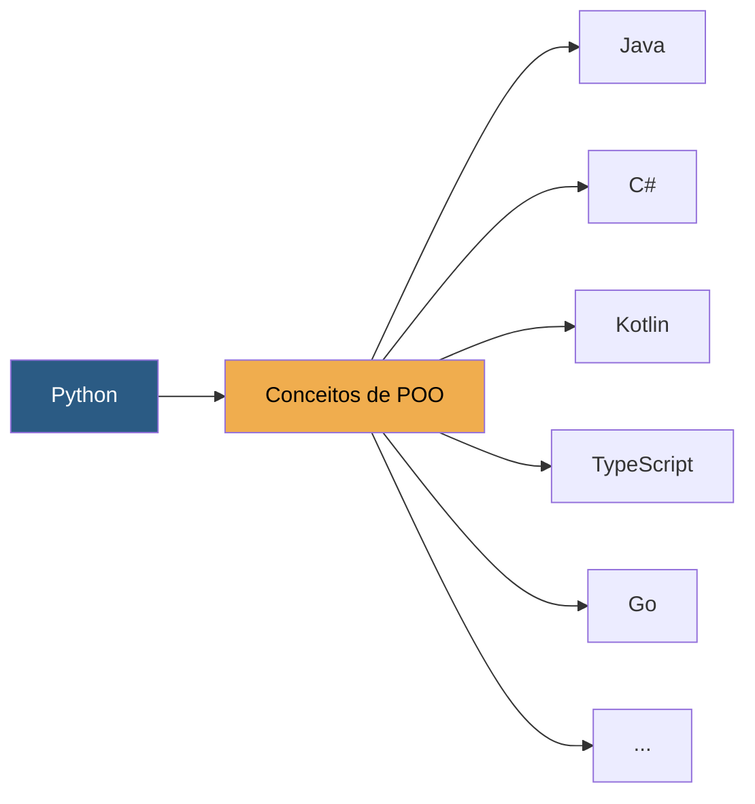

# O projeto da disciplina

Durante as aulas construiremos um sistema de **E-Commerce**. Esse sistema será desenvolvido gradualmente, exatamente como ocorreria em uma empresa. Não começaremos implementando dezenas de funcionalidades.

1. Primeiro entenderemos o problema. 
2. Depois modelaremos o domínio. 
3. Em seguida implementaremos pequenas partes. 
4. Posteriormente adicionaremos novas funcionalidades, sempre procurando manter o código organizado.

## Funcionalidades previstas

Ao final do semestre teremos um sistema relativamente completo, contendo diversos conceitos de orientação a objetos e vários padrões de projeto.

Entre as funcionalidades previstas estão:

- Gerenciamento de produtos
- Categorias
- Clientes
- Carrinho de compras
- Cálculo de descontos
- Cupons promocionais
- Formas de pagamento
- Processamento de pedidos
- Controle de estoque
- Emissão de notas simplificadas
- Notificações
- Persistência dos dados
- Testes automatizados

Naturalmente, essas funcionalidades serão implementadas aos poucos. Cada uma delas servirá como contexto para introduzir novos conceitos.

---

## O projeto individual

Enquanto desenvolvemos o E-Commerce em sala, cada estudante desenvolverá **outro sistema**: um **Sistema de Controle Financeiro Pessoal**.

!!! tip "Objetivo do projeto individual"

    O objetivo não é copiar o projeto do professor. Pelo contrário. O objetivo é aplicar os mesmos princípios aprendidos durante as aulas em um domínio completamente diferente.

### Vantagens da estratégia

1. **Evita a reprodução mecânica** — o aluno não apenas reproduz o código apresentado em sala
2. **Exige análise própria** — cada estudante precisa analisar um novo problema antes de decidir como implementar sua solução
3. **Verifica o aprendizado** — permite verificar se os conceitos realmente foram compreendidos

### Como funciona

Sempre que um novo conceito for apresentado no projeto do E-Commerce, você deverá identificar como aquele mesmo conceito pode ser aplicado ao sistema financeiro.

Ao final do semestre, teremos **dois sistemas diferentes**, mas desenvolvidos utilizando os **mesmos princípios de projeto**.

??? question "Possíveis funcionalidades do sistema financeiro"

    - Controle de receitas e despesas
    - Categorias de gastos
    - Orçamento mensal
    - Metas de economia
    - Relatórios por período
    - Cartões de crédito e faturas
    - Investimentos

Dessa forma, nossa metodologia de aprendizado terá uma abordagem prática, baseada em projetos, exemplificada nesse quadro:

Sempre partiremos de um **problema do mundo real**. Primeiro entenderemos o domínio. Depois identificaremos responsabilidades. Somente então escreveremos código.

Nossa principal pergunta durante todo o semestre será:

> **Quem deveria ser responsável por executar esta regra de negócio?**

Essa pergunta parece simples. Entretanto, ela está presente em praticamente todas as decisões de projeto.

---

## Muito além do Python

Embora toda a implementação seja realizada em Python, **este não é um curso sobre Python**. Python será apenas a ferramenta utilizada para implementar as soluções. Os conceitos estudados são independentes da linguagem.

Ao aprender a distribuir responsabilidades corretamente entre classes, reduzir acoplamento ou aplicar padrões de projeto, você estará adquirindo conhecimentos que poderão ser utilizados em **Java, C#, Kotlin, PHP, TypeScript, Go** e diversas outras linguagens orientadas a objetos.

!!! info "Foco do curso"

    Por esse motivo, durante as aulas discutiremos muito mais **por que determinada solução foi escolhida** do que simplesmente **como escrevê-la em Python**.
