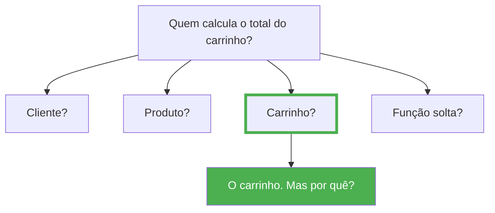
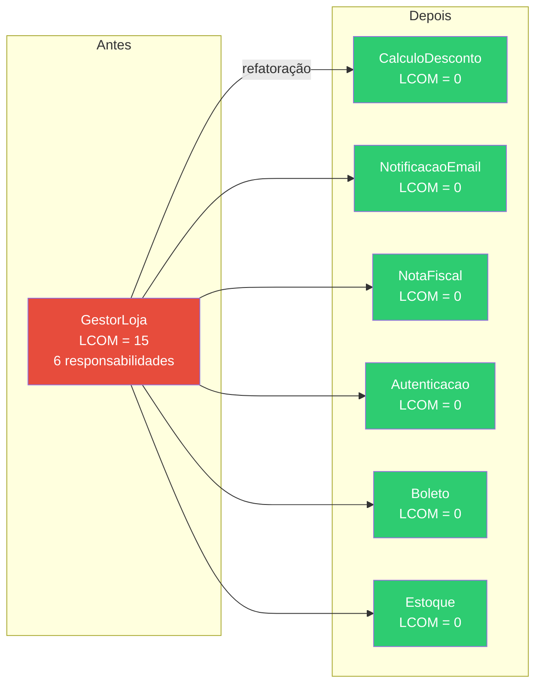
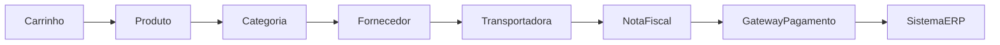
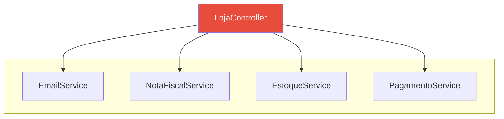
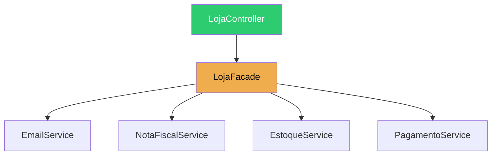
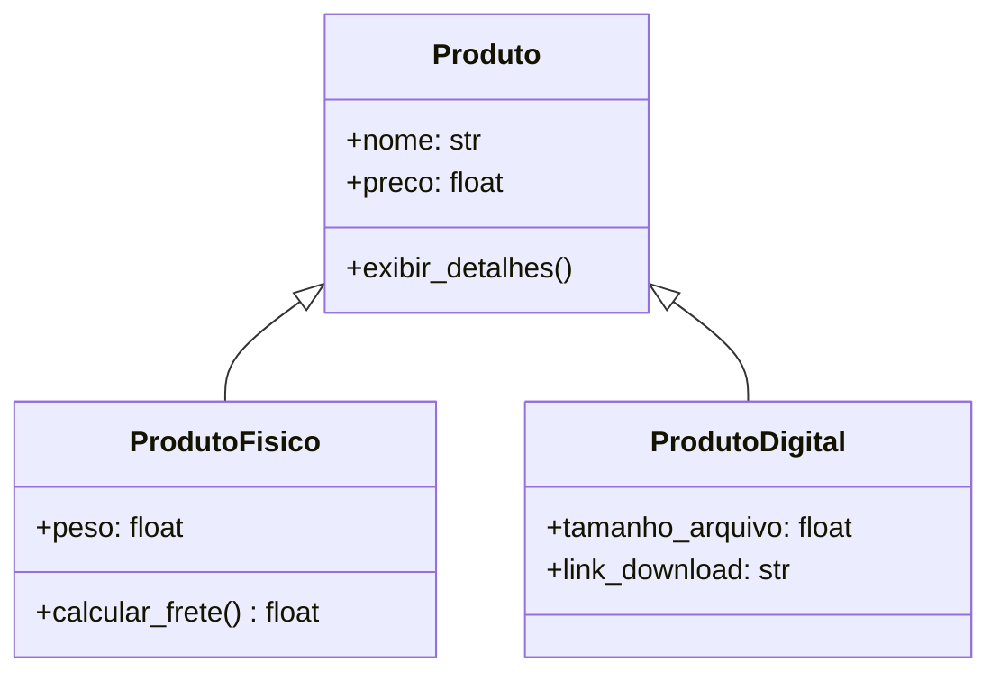
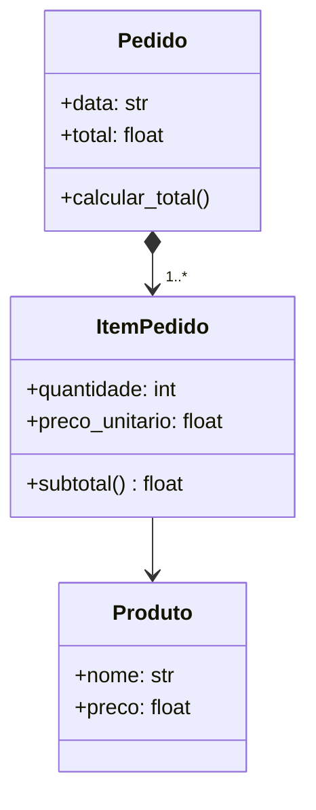

# Revisando Orientação a Objetos

Uma definição bastante conhecida diz que Programação Orientada a Objetos é um paradigma baseado em objetos que encapsulam dados e comportamentos. Embora essa definição esteja correta, ela ainda é insuficiente.

Na prática, desenvolver orientado a objetos significa **dividir um problema complexo em pequenos objetos**, cada um responsável por uma parte do sistema. Cada objeto possui um conjunto limitado de responsabilidades. Esses objetos colaboram entre si para resolver problemas maiores.

!!! warning "Sinal de alerta"

    Uma consequência importante dessa abordagem é que **nenhum objeto deve tentar resolver tudo sozinho**. Quando encontramos uma classe enorme, com centenas ou milhares de linhas de código e dezenas de responsabilidades diferentes, normalmente estamos diante de um problema de projeto.

---

## Objetos representam conceitos do domínio

Observe as seguintes classes:

```python
class Produto:
    pass


class Cliente:
    pass


class Carrinho:
    pass
```

Esses nomes não foram escolhidos por acaso. Eles fazem parte da linguagem utilizada pelas pessoas que trabalham em uma loja virtual. Essa ideia é extremamente importante.

!!! tip "A linguagem do domínio"

    Sempre que possível, nossas classes devem representar conceitos reais do domínio. Quando um especialista da área conversa com um desenvolvedor, ambos deveriam compreender o significado dessas classes.

    Se começarmos a criar classes chamadas `Processador123`, `UtilitarioGlobal`, `SistemaManager` ou `ClasseAuxiliar`, provavelmente estamos nos afastando da linguagem do domínio.

---

## Classes existem para representar comportamento

Um erro bastante comum entre iniciantes é imaginar que uma classe serve apenas para armazenar dados.

```python
class Produto:

    def __init__(self):
        self.nome = ""
        self.preco = 0
```

Essa classe praticamente funciona como um dicionário. Ela não possui comportamento. Ela apenas guarda informações.

Agora imagine um produto que sabe responder perguntas sobre si mesmo:

```python
produto.esta_disponivel()
produto.aplicar_desconto(10)
produto.alterar_preco(1500)
produto.aumentar_preco(5)
```

Agora estamos começando a utilizar objetos da maneira como foram concebidos. Objetos possuem **estado**, mas também possuem **comportamento**. Aliás, muitas vezes o comportamento é mais importante que os próprios atributos.

---

## Objetos ricos e objetos anêmicos

Este é um conceito que aparecerá diversas vezes durante o curso.

=== "Objeto anêmico"

    ```python
    class Produto:

        def __init__(self, nome, preco):
            self.nome = nome
            self.preco = preco
    ```

    Apenas armazena dados. Sem comportamento relevante.

=== "Objeto rico"

    ```python
    class Produto:

        def __init__(self, nome, preco):
            self.nome = nome
            self.preco = preco

        def aplicar_desconto(self, percentual):
            ...

        def aumentar_preco(self, percentual):
            ...

        def alterar_preco(self, novo_preco):
            ...

        def esta_disponivel(self):
            ...
    ```

    Armazena dados **e** sabe agir sobre eles.

Qual delas representa melhor um produto? A segunda. Ela não apenas armazena informações, mas também sabe agir. Chamamos esse tipo de objeto de **objeto rico**. Já objetos que apenas armazenam dados são frequentemente chamados de **objetos anêmicos**.

??? info "Objeto rico vs. Objeto anêmico"

    | Característica | Objeto Anêmico | Objeto Rico |
    |----------------|----------------|-------------|
    | Contém dados | Sim | Sim |
    | Contém comportamento | Não (ou mínimo) | Sim |
    | Protege suas regras | Não — qualquer um altera os atributos | Sim — oferece métodos específicos |
    | Facilidade de teste | Baixa — lógica espalhada pelo sistema | Alta — comportamento encapsulado |
    | Exemplo | `produto.preco = -500` | `produto.aplicar_desconto(10)` |
    | Manutenibilidade | Difícil — regras duplicadas | Fácil — regras em um só lugar |

    ```python
    # Objeto anêmico — apenas dados
    class Produto:
        def __init__(self, nome, preco):
            self.nome = nome
            self.preco = preco

    # Uso: regra de desconto fica fora da classe
    def aplicar_desconto(produto, percentual):
        produto.preco -= produto.preco * (percentual / 100)
    ```

    ```python
    # Objeto rico — dados + comportamento
    class Produto:
        def __init__(self, nome, preco):
            self.nome = nome
            self.preco = preco

        def aplicar_desconto(self, percentual):
            if not 0 <= percentual <= 100:
                raise ValueError("Percentual inválido")
            self.preco -= self.preco * (percentual / 100)
    ```

    Perceba que no objeto rico a **regra de negócio** (validação do percentual, cálculo do desconto) está dentro da própria classe. No objeto anêmico, essa regra precisaria ser replicada em cada lugar que altera o preço — o que gera duplicação e erros.

??? tip "Quando usar cada um?"

    - **Objetos anêmicos** são aceitáveis em camadas de transferência de dados (DTOs) ou registros de banco de dados, onde o objetivo é apenas transportar informações.
    - **Objetos ricos** devem ser a regra na camada de domínio, onde as regras de negócio precisam ser protegidas e encapsuladas.

Ao longo do curso, evitaremos transformar nossas classes em simples estruturas de dados.

---

## Encapsulamento

Quando falamos em encapsulamento, muitos alunos imediatamente pensam em atributos privados. Embora isso faça parte do conceito, encapsulamento é **muito mais** do que esconder atributos.

Encapsular significa **proteger as regras do objeto**.

```python
# Problema: qualquer parte do sistema pode definir um preço inválido
produto.preco = -500
```

Nosso objeto deveria impedir situações inválidas. Uma alternativa melhor seria oferecer operações específicas:

```python
produto.alterar_preco(1500)
produto.aplicar_desconto(10)
```

Perceba a diferença. Não estamos apenas escondendo atributos. Estamos protegendo as regras do negócio.

!!! warning "Getters e setters não são encapsulamento"

    Muitos desenvolvedores acreditam que encapsular é criar `getters` e `setters` para cada atributo. Isso não passa de uma ilusão — você continua expondo os dados e permitindo que qualquer parte do sistema os altere livremente.

    ```python
    # Isto NÃO é encapsulamento de verdade
    class Produto:

        def __init__(self, preco):
            self._preco = preco

        def get_preco(self):
            return self._preco

        def set_preco(self, valor):       # (1)
            self._preco = valor
    ```

    1.  Este setter permite qualquer valor, inclusive negativo. É um acesso direto disfarçado.

    O que realmente importa não é se o atributo é público ou privado — é se o objeto oferece **operações que fazem sentido para o domínio**. Um produto não deveria permitir "definir preço" genericamente; ele deveria permitir `alterar_preco`, `aplicar_desconto`, `aumentar_preco`. Cada uma dessas operações pode aplicar validações e regras específicas.

Em geral, quando falamos de regras de negócios de um sistema, surge um conceito importante, chamado *invariante*.  **Invariante** é uma condição que deve ser sempre verdadeira para um objeto. Por exemplo, um `Produto` pode ter como invariante que seu preço seja sempre positivo. Um `Pedido` pode ter como invariante que sua data de criação não seja no futuro. Cabe ao próprio objeto garantir que suas invariantes nunca sejam violadas — e é exatamente isso que o encapsulamento viabiliza.

??? tip "Regra prática"

    Se um `setter` apenas atribui o valor sem nenhuma validação ou regra, ele não está encapsulando nada. Nesse caso, um atributo público direto teria o mesmo efeito. O encapsulamento só faz sentido quando o método **protege uma invariante do objeto**.

!!! success "Princípio"

    Esse será um princípio importante durante todo o desenvolvimento do sistema: **cada objeto é responsável por manter seu próprio estado válido**.

---

## Responsabilidade das classes

Talvez esta seja a ideia mais importante de toda a disciplina. Sempre que criarmos uma classe faremos a seguinte pergunta:

> **De quem é esta responsabilidade?**



Quem conhece todos os itens adicionados? O carrinho. Logo, ele é quem possui as informações necessárias para realizar esse cálculo.

Esse tipo de raciocínio será repetido dezenas de vezes durante o semestre.

---

## Coesão

Uma classe **coesa** possui um objetivo claro. Quanto mais responsabilidades diferentes uma classe acumula, menor tende a ser sua coesão — e mais difícil o sistema se torna de entender, testar e manter.

### Exemplo: baixa coesão

A classe abaixo mistura responsabilidades de domínios completamente diferentes. Note, nos comentários, que **cada método utiliza um atributo diferente** — eles raramente compartilham dados:

```python
class GestorLoja:

    def __init__(self):
        self.valor_pedido = 0        # usado por: calcular_desconto
        self.servidor_smtp = None    # usado por: enviar_email
        self.dados_fiscais = None    # usado por: gerar_nota_fiscal
        self.usuario_logado = None   # usado por: autenticar_usuario
        self.codigo_boleto = None    # usado por: imprimir_boleto
        self.produtos_estoque = []   # usado por: controlar_estoque

    def calcular_desconto(self, valor, percentual):    # acessa: valor_pedido
        ...

    def enviar_email(self, destinatario, mensagem):    # acessa: servidor_smtp
        ...

    def gerar_nota_fiscal(self, pedido):                # acessa: dados_fiscais
        ...

    def autenticar_usuario(self, usuario, senha):       # acessa: usuario_logado
        ...

    def imprimir_boleto(self, pedido):                  # acessa: codigo_boleto
        ...

    def controlar_estoque(self, produto, quantidade):   # acessa: produtos_estoque
        ...
```

**Matriz método vs. atributo** (X = método acessa o atributo):

| Método | `valor_pedido` | `servidor_smtp` | `dados_fiscais` | `usuario_logado` | `codigo_boleto` | `produtos_estoque` |
|--------|:---:|:---:|:---:|:---:|:---:|:---:|
| `calcular_desconto` | X |   |   |   |   |   |
| `enviar_email` |   | X |   |   |   |   |
| `gerar_nota_fiscal` |   |   | X |   |   |   |
| `autenticar_usuario` |   |   |   | X |   |   |
| `imprimir_boleto` |   |   |   |   | X |   |
| `controlar_estoque` |   |   |   |   |   | X |

Cada método acessa um atributo **exclusivo**. Nenhum par de métodos compartilha dados.

### Métrica LCOM — *Lack of Cohesion of Methods*

A métrica **LCOM** (Chidamber & Kemerer, 1994) quantifica a falta de coesão comparando pares de métodos:

```
LCOM = (pares que NÃO compartilham atributos) - (pares que compartilham)
```

Se o resultado for negativo, considera-se LCOM = 0.

**Cálculo para `GestorLoja`:**

A notação C(*n*, *k*) representa **combinações**: de *n* elementos, quantos grupos de *k* podemos formar? A fórmula é:

```
C(n, k) = n! / (k! * (n - k)!)
```

No nosso caso, queremos saber quantos pares de métodos existem em uma classe com 6 métodos:

```
C(6,2) = 6! / (2! * 4!) = (6 * 5) / 2 = 15 pares
```

Como cada método acessa um atributo diferente, **nenhum** par compartilha dados:

- Total de pares de métodos: C(6,2) = 15
- Pares que compartilham ao menos um atributo: **0**
- Pares que NÃO compartilham: **15**

```
LCOM = 15 - 0 = 15
```

Um LCOM alto indica que a classe faz várias coisas ao mesmo tempo — um forte sinal de que deveria ser dividida.

---

### Refatorando: alta coesão

Cada grupo de responsabilidades ganha sua própria classe. Agora cada método compartilha atributos com os demais métodos da mesma classe:

```python
class CalculoDesconto:

    def __init__(self):
        self.valor_pedido = 0   # compartilhado entre métodos da classe

    def calcular(self, valor, percentual):          # acessa: valor_pedido
        ...


class NotificacaoEmail:

    def __init__(self):
        self.servidor_smtp = None

    def enviar(self, destinatario, mensagem):        # acessa: servidor_smtp
        ...


class NotaFiscal:

    def __init__(self):
        self.dados_fiscais = None

    def gerar(self, pedido):                        # acessa: dados_fiscais
        ...


class Autenticacao:

    def __init__(self):
        self.usuario_logado = None

    def autenticar(self, usuario, senha):           # acessa: usuario_logado
        ...


class Boleto:

    def __init__(self):
        self.codigo_boleto = None

    def imprimir(self, pedido):                     # acessa: codigo_boleto
        ...


class Estoque:

    def __init__(self):
        self.produtos_estoque = []

    def controlar(self, produto, quantidade):       # acessa: produtos_estoque
        ...
```

**Cálculo do LCOM para cada classe** (exemplo com `CalculoDesconto`):

A classe `CalculoDesconto` tem apenas **1 método**. Para formar um par, precisamos de 2 métodos — o que é impossível:

```
C(1,2) = 1! / (2! * (-1)!) = 0 pares
```

Quando *k* > *n*, não há combinações possíveis, então C(*n*, *k*) = 0.

- Total de pares de métodos: C(1,2) = 0
- Pares que compartilham ao menos um atributo: **0**
- Pares que NÃO compartilham: **0**

```
LCOM = 0 - 0 = 0
```

LCOM = 0 significa coesão máxima — cada classe tem um propósito único e todos os seus métodos colaboram em torno dos mesmos dados.



| Métrica | Antes (`GestorLoja`) | Depois (cada classe) |
|---------|:--------------------:|:--------------------:|
| LCOM | 15 | 0 |
| Responsabilidades por classe | 6 | 1 |
| Facilidade de teste | Difícil (mockar tudo) | Fácil (testes isolados) |
| Manutenibilidade | Baixa | Alta |

??? tip "Ferramentas que medem coesão"

    Ferramentas de análise estática como **SonarQube**, **CodeClimate** e **Python Radon** calculam métricas de coesão (inclusive LCOM) automaticamente. Durante o curso veremos como interpretar esses números para guiar decisões de refatoração.

---

## Acoplamento

Agora imagine que, para calcular o valor total da compra, o `Carrinho` precise conhecer:



Perceba como isso dificulta qualquer alteração. Se modificarmos a classe `Transportadora`, será que quebraremos o `Carrinho`? Talvez.

Esse tipo de dependência excessiva recebe o nome de **alto acoplamento**.

!!! warning "Alto acoplamento é um problema"

    Quanto mais dependências uma classe possui, mais frágil o sistema se torna. Ao longo do curso procuraremos reduzir essas dependências sempre que possível.

### Métricas de acoplamento

Para medir o acoplamento, existem três métricas clássicas:

| Métrica | Mede | O que significa |
|---------|------|----------------|
| **CBO** (*Coupling Between Objects*) | Quantidade total de classes que uma classe depende **somadas** às que dependem dela | Quanto maior, pior — a classe está fortemente acoplada |
| **Fan-in** | Quantas outras classes **usam** a classe analisada | Número de dependentes — alto pode indicar um ponto central |
| **Fan-out** | Quantas classes a classe analisada **usa** | Número de dependências — alto indica que a classe sabe demais sobre o sistema |

#### Exemplo: alta dependência

Considere a classe `LojaController`, que centraliza todas as operações do sistema:

```python
class LojaController:

    def finalizar_compra(self, pedido):
        self.enviar_email(pedido)
        self.gerar_nota_fiscal(pedido)
        self.atualizar_estoque(pedido)
        self.processar_pagamento(pedido)
```

Para executar sua tarefa, `LojaController` depende diretamente de 4 classes diferentes:



**Métricas para `LojaController`:**

- **Fan-out:** 4 (depende de 4 classes externas)
- **Fan-in:** 0 (nenhuma classe depende dela — é um ponto de entrada)
- **CBO:** 4 (Fan-out + Fan-in = 4 + 0)

Quem mais depende de `EmailService`? Se várias classes o usam, o Fan-in de `EmailService` será alto, tornando-o um ponto crítico — qualquer alteração nele pode quebrar toda a aplicação.

#### Refatorando: baixo acoplamento

Aplicamos a inversão de dependências: `LojaController` não instancia os serviços diretamente; eles são injetados e coordenados por uma fachada:

```python
class LojaController:

    def __init__(self, facade):
        self.facade = facade   # único acoplamento direto

    def finalizar_compra(self, pedido):
        self.facade.finalizar(pedido)
```

A classe `LojaFacade` centraliza a coordenação, mas cada serviço permanece independente:



**Métricas para `LojaController`:**

- **Fan-out:** 1 (depende apenas de `LojaFacade`)
- **Fan-in:** 0
- **CBO:** 1 (Fan-out + Fan-in = 1 + 0)

**Métricas para `LojaFacade`:**

- **Fan-out:** 4 (usa os 4 serviços)
- **Fan-in:** 1 (`LojaController` a usa)
- **CBO:** 5

O acoplamento foi **redistribuído**: `LojaController` foi de CBO = 4 para CBO = 1. A `Facade` agora é o único ponto com CBO alto, mas isso é intencional — ela existe justamente para isolar o resto do sistema.

| Classe | Antes (CBO) | Depois (CBO) |
|--------|:-----------:|:------------:|
| `LojaController` | 4 | **1** |
| Demais serviços | 1 cada | 1 cada |

??? tip "Ferramentas que medem acoplamento"

    **SonarQube**, **PyCharm** (inspeções de dependência) e **Radon** calculam CBO, Fan-in e Fan-out automaticamente. Valores altos são alertas para revisão de projeto.

---

## Composição e Herança

Outro erro bastante comum é utilizar herança apenas para reaproveitar código.

Herança deve representar uma relação do tipo **é um**. Composição representa **possui um** ou **é formado por**.

### Herança (é um)



```python
class Produto:
    def __init__(self, nome, preco):
        self.nome = nome
        self.preco = preco

    def exibir_detalhes(self):
        return f"{self.nome} — R$ {self.preco:.2f}"


class ProdutoFisico(Produto):
    def __init__(self, nome, preco, peso):
        super().__init__(nome, preco)
        self.peso = peso

    def calcular_frete(self):
        return self.peso * 1.5


class ProdutoDigital(Produto):
    def __init__(self, nome, preco, tamanho_arquivo):
        super().__init__(nome, preco)
        self.tamanho_arquivo = tamanho_arquivo
        self.link_download = ""
```

Um `ProdutoFisico` **é um** `Produto`. Ele herda `nome`, `preco` e `exibir_detalhes()`, mas também possui o atributo específico `peso` e o método `calcular_frete()`. O mesmo vale para `ProdutoDigital`. Ambos compartilham a essência de "ser produto", cada um com suas particularidades.

### Composição (possui um / é formado por)



```python
class ItemPedido:
    def __init__(self, produto, quantidade, preco_unitario):
        self.produto = produto
        self.quantidade = quantidade
        self.preco_unitario = preco_unitario

    def subtotal(self):
        return self.quantidade * self.preco_unitario


class Pedido:
    def __init__(self, data):
        self.data = data
        self.itens = []          # Pedido é composto por itens

    def adicionar_item(self, produto, quantidade, preco):
        item = ItemPedido(produto, quantidade, preco)
        self.itens.append(item)

    def calcular_total(self):
        return sum(item.subtotal() for item in self.itens)
```

Um `Pedido` **é composto por** um ou mais `ItemPedido`. Se o pedido for cancelado, aqueles itens deixam de existir como parte daquele pedido. Cada `ItemPedido`, por sua vez, **referencia** um `Produto` — mas o produto existe independentemente. Essa distinção é importante: composição (losango preenchido) indica que a parte não existe sem o todo; associação simples (seta) indica apenas uma referência.

### Comparação

| Situação | Pergunta | Relação | Exemplo UML |
|----------|----------|---------|-------------|
| `ProdutoFisico` e `Produto` | ProdutoFisico **é um** Produto? | Herança | Triângulo vazio na superclasse |
| `ProdutoDigital` e `Produto` | ProdutoDigital **é um** Produto? | Herança | Triângulo vazio na superclasse |
| `Pedido` e `ItemPedido` | ItemPedido **é um** Pedido? | Composição | Losango preenchido no todo |
| `ItemPedido` e `Produto` | Item **é um** Produto? | Associação | Seta simples (referência) |

Sempre que houver dúvida, faça a seguinte pergunta:

> **Posso substituir a frase por "é um"?**

Se a resposta for **não**, provavelmente herança não é a melhor solução.

Durante este curso, veremos que **composição será utilizada muito mais frequentemente do que herança**, refletindo uma prática comum em projetos modernos.

---

## Uma última reflexão

Ao terminar esta revisão, talvez você tenha percebido algo interessante: nós ainda não escrevemos uma única linha do sistema. Mesmo assim, já discutimos decisões que influenciarão todo o projeto.

Isso acontece porque bons sistemas **não começam pelo código**. Eles começam pelas ideias. E somente quando entendemos bem o problema é que faz sentido escolher como implementá-lo.
