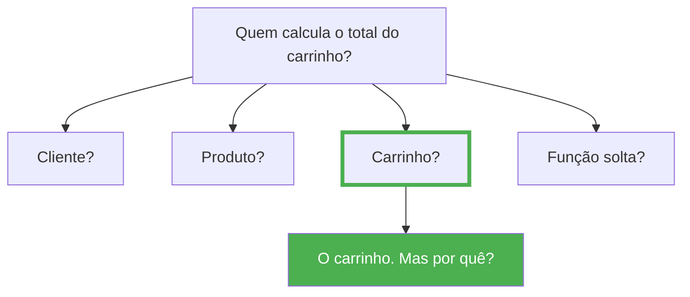

# Revisando Orientação a Objetos

Uma definição bastante conhecida diz que Programação Orientada a Objetos é um paradigma baseado em objetos que encapsulam dados e comportamentos. Embora essa definição esteja correta, ela ainda é insuficiente.

Na prática, desenvolver orientado a objetos significa **dividir um problema complexo em pequenos objetos**, cada um responsável por uma parte do sistema. Cada objeto possui um conjunto limitado de responsabilidades. Esses objetos colaboram entre si para resolver problemas maiores.

!!! warning "Sinal de alerta"

    Uma consequência importante dessa abordagem é que **nenhum objeto deve tentar resolver tudo sozinho**. Quando encontramos uma classe enorme, com centenas ou milhares de linhas de código e dezenas de responsabilidades diferentes, normalmente estamos diante de um problema de projeto.

---

## Objetos representam conceitos do domínio

Observe as seguintes classes:

```python
class Produto:
    pass


class Cliente:
    pass


class Carrinho:
    pass
```

Esses nomes não foram escolhidos por acaso. Eles fazem parte da linguagem utilizada pelas pessoas que trabalham em uma loja virtual. Essa ideia é extremamente importante.

!!! tip "A linguagem do domínio"

    Sempre que possível, nossas classes devem representar conceitos reais do domínio. Quando um especialista da área conversa com um desenvolvedor, ambos deveriam compreender o significado dessas classes.

    Se começarmos a criar classes chamadas `Processador123`, `UtilitarioGlobal`, `SistemaManager` ou `ClasseAuxiliar`, provavelmente estamos nos afastando da linguagem do domínio.

---

## Classes existem para representar comportamento

Um erro bastante comum entre iniciantes é imaginar que uma classe serve apenas para armazenar dados.

```python
class Produto:

    def __init__(self) -> None:
        self.nome = ""
        self.preco = 0
```

Essa classe praticamente funciona como um dicionário. Ela não possui comportamento. Ela apenas guarda informações.

Agora imagine um produto que sabe responder perguntas sobre si mesmo:

```python
produto.esta_disponivel()
produto.aplicar_desconto(10)
produto.alterar_preco(1500)
produto.aumentar_preco(5)
```

Agora estamos começando a utilizar objetos da maneira como foram concebidos. Objetos possuem **estado**, mas também possuem **comportamento**. Aliás, muitas vezes o comportamento é mais importante que os próprios atributos.

---

## Objetos ricos e objetos anêmicos

Este é um conceito que aparecerá diversas vezes durante o curso.

=== "Objeto anêmico"

    ```python
    class Produto:

        def __init__(self, nome: str, preco: float) -> None:
            self.nome = nome
            self.preco = preco
    ```
    
    Apenas armazena dados. Sem comportamento relevante.
    
    === "Objeto rico"
    
    ```python
    class Produto:
    
        def __init__(self, nome: str, preco: float) -> None:
            self.nome = nome
            self.preco = preco

        def aplicar_desconto(self, percentual: float) -> None:
            ...

        def aumentar_preco(self, percentual: float) -> None:
            ...

        def alterar_preco(self, novo_preco: float) -> None:
            ...

        def esta_disponivel(self) -> bool:
            ...
    ```

    Armazena dados **e** sabe agir sobre eles.

Qual delas representa melhor um produto? A segunda. Ela não apenas armazena informações, mas também sabe agir. Chamamos esse tipo de objeto de **objeto rico**. Já objetos que apenas armazenam dados são frequentemente chamados de **objetos anêmicos**.

??? info "Objeto rico vs. Objeto anêmico"

    | Característica | Objeto Anêmico | Objeto Rico |
    |----------------|----------------|-------------|
    | Contém dados | Sim | Sim |
    | Contém comportamento | Não (ou mínimo) | Sim |
    | Protege suas regras | Não — qualquer um altera os atributos | Sim — oferece métodos específicos |
    | Facilidade de teste | Baixa — lógica espalhada pelo sistema | Alta — comportamento encapsulado |
    | Exemplo | `produto.preco = -500` | `produto.aplicar_desconto(10)` |
    | Manutenibilidade | Difícil — regras duplicadas | Fácil — regras em um só lugar |

    ```python
    # Objeto anêmico — apenas dados
    class Produto:
        def __init__(self, nome: str, preco: float) -> None:
            self.nome = nome
            self.preco = preco

    # Uso: regra de desconto fica fora da classe
    def aplicar_desconto(produto: Produto, percentual: float) -> None:
        produto.preco -= produto.preco * (percentual / 100)
    ```

    ```python
    # Objeto rico — dados + comportamento
    class Produto:
        def __init__(self, nome: str, preco: float) -> None:
            self.nome = nome
            self.preco = preco

        def aplicar_desconto(self, percentual: float) -> None:
            if not 0 <= percentual <= 100:
                raise ValueError("Percentual inválido")
            self.preco -= self.preco * (percentual / 100)
    ```

    Perceba que no objeto rico a **regra de negócio** (validação do percentual, cálculo do desconto) está dentro da própria classe. No objeto anêmico, essa regra precisaria ser replicada em cada lugar que altera o preço — o que gera duplicação e erros.

??? tip "Quando usar cada um?"

    - **Objetos anêmicos** são aceitáveis em camadas de transferência de dados (DTOs) ou registros de banco de dados, onde o objetivo é apenas transportar informações.
    - **Objetos ricos** devem ser a regra na camada de domínio, onde as regras de negócio precisam ser protegidas e encapsuladas.

Ao longo do curso, evitaremos transformar nossas classes em simples estruturas de dados.

---

## Encapsulamento

Quando falamos em encapsulamento, muitos alunos imediatamente pensam em atributos privados. Embora isso faça parte do conceito, encapsulamento é **muito mais** do que esconder atributos.

Encapsular significa **proteger as regras do objeto**.

```python
# Problema: qualquer parte do sistema pode definir um preço inválido
produto.preco = -500
```

Nosso objeto deveria impedir situações inválidas. Uma alternativa melhor seria oferecer operações específicas:

```python
produto.alterar_preco(1500)
produto.aplicar_desconto(10)
```

Perceba a diferença. Não estamos apenas escondendo atributos. Estamos protegendo as regras do negócio.

!!! warning "Getters e setters não são encapsulamento"

    Muitos desenvolvedores acreditam que encapsular é criar `getters` e `setters` para cada atributo. Isso não passa de uma ilusão — você continua expondo os dados e permitindo que qualquer parte do sistema os altere livremente.

    ```python
    # Isto NÃO é encapsulamento de verdade
    class Produto:

        def __init__(self, preco: float) -> None:
            self._preco = preco

        def get_preco(self) -> float:
            return self._preco

        def set_preco(self, valor: float) -> None:  # (1)
            self._preco = valor
    ```
    
    1.  Este setter permite qualquer valor, inclusive negativo. É um acesso direto disfarçado.

    O que realmente importa não é se o atributo é público ou privado — é se o objeto oferece **operações que fazem sentido para o domínio**. Um produto não deveria permitir "definir preço" genericamente; ele deveria permitir `alterar_preco`, `aplicar_desconto`, `aumentar_preco`. Cada uma dessas operações pode aplicar validações e regras específicas.

Em geral, quando falamos de regras de negócios de um sistema, surge um conceito importante, chamado *invariante*.  **Invariante** é uma condição que deve ser sempre verdadeira para um objeto. Por exemplo, um `Produto` pode ter como invariante que seu preço seja sempre positivo. Um `Pedido` pode ter como invariante que sua data de criação não seja no futuro. Cabe ao próprio objeto garantir que suas invariantes nunca sejam violadas — e é exatamente isso que o encapsulamento viabiliza.

??? tip "Regra prática"

    Se um `setter` apenas atribui o valor sem nenhuma validação ou regra, ele não está encapsulando nada. Nesse caso, um atributo público direto teria o mesmo efeito. O encapsulamento só faz sentido quando o método **protege uma invariante do objeto**.

!!! success "Princípio"

    Esse será um princípio importante durante todo o desenvolvimento do sistema: **cada objeto é responsável por manter seu próprio estado válido**.

---

## Responsabilidade das classes

Talvez esta seja a ideia mais importante de toda a disciplina. Sempre que criarmos uma classe faremos a seguinte pergunta:

> **De quem é esta responsabilidade?**



Quem conhece todos os itens adicionados? O carrinho. Logo, ele é quem possui as informações necessárias para realizar esse cálculo.

Esse tipo de raciocínio será repetido dezenas de vezes durante o semestre.

---

## Uma última reflexão

Ao terminar esta revisão, talvez você tenha percebido algo interessante: nós ainda não escrevemos uma única linha do sistema. Mesmo assim, já discutimos decisões que influenciarão todo o projeto.

Isso acontece porque bons sistemas **não começam pelo código**. Eles começam pelas ideias. E somente quando entendemos bem o problema é que faz sentido escolher como implementá-lo.

---

## Aplicando ao Projeto Financeiro

Volte ao sistema financeiro que você desenvolverá. Um `Cliente` no E-Commerce possui nome e email. Uma `Conta` no sistema financeiro possui... o quê? Que atributos e comportamentos ela teria? Pense nisso antes de começar a modelagem.

---

Agora que revisamos os fundamentos, vamos explorar o domínio do nosso E-Commerce para entender como ele realmente funciona.
