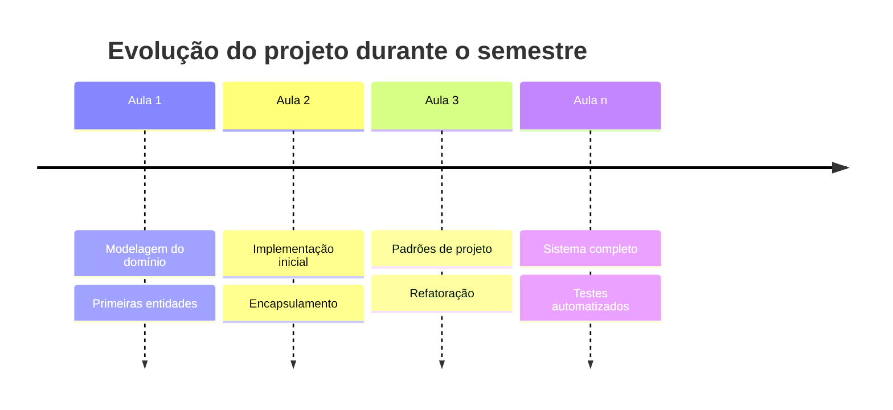

# Programação Orientada a Objetos II

!!! warning "Material em desenvolvimento"

    Este conteúdo está em fase de **elaboração** — é um esboço inicial. Seções podem estar incompletas, diagramas podem ser ajustados e exemplos ainda estão sendo refinados. Sugestões são bem-vindas no [repositório do projeto](https://github.com/eduardo-da-silva/poo-ii).

Bem-vindo à disciplina de **Programação Orientada a Objetos II**. Este site reúne o material didático utilizado durante o semestre, organizado no formato de livro-texto para acompanhamento das aulas.

## Bem-vindo ao curso

Até este momento da sua formação, você já aprendeu a utilizar Python, funções, módulos, estruturas de dados, tratamento de exceções, orientação a objetos e diversos recursos da linguagem.

Entretanto, existe uma diferença enorme entre **saber utilizar uma linguagem de programação** e **saber desenvolver software**.

É comum que um programador iniciante consiga resolver pequenos problemas utilizando classes e objetos, mas encontre dificuldades quando precisa desenvolver um sistema que possui dezenas ou centenas de classes, regras de negócio complexas e código que precisará ser mantido durante vários anos.

Este curso foi pensado exatamente para preencher essa lacuna.

!!! info "Nosso verdadeiro objetivo"

    Nosso objetivo não é apenas aprender novos recursos da linguagem Python. Nosso objetivo é aprender a **projetar software**.

Ao longo do semestre veremos como tomar decisões de projeto, distribuir responsabilidades entre classes, reduzir acoplamento, aumentar coesão e construir sistemas que possam crescer sem se transformar em um conjunto de códigos difíceis de entender e manter. Em outras palavras, nosso foco será aprender a pensar como um **arquiteto de software**.

---

## Como será conduzido o curso

Grande parte do curso será baseada em um **único projeto**. Em vez de construir dezenas de pequenos exemplos desconectados, construiremos um sistema real, que evoluirá aula após aula.

Cada novo conceito estudado será imediatamente aplicado nesse sistema. Dessa forma, será possível observar como decisões tomadas nas primeiras aulas influenciam todo o restante do projeto.

??? tip "Por que um único projeto?"

    Essa abordagem possui uma vantagem importante: você aprenderá que software não nasce pronto. Ele **evolui**. Durante o desenvolvimento perceberemos erros de projeto, identificaremos oportunidades de melhoria e realizaremos diversas refatorações. Isso faz parte do desenvolvimento profissional de software. Programadores experientes não escrevem código perfeito na primeira tentativa. Eles escrevem código suficientemente bom, aprendem com a evolução do sistema e realizam melhorias continuamente.

---

## Ementa

- Princípios de projeto orientado a objetos
- Padrões de projeto (*Design Patterns*)
- Modelagem de domínio
- Boas práticas de desenvolvimento
- Construção de um sistema E-Commerce completo

## Projeto prático

Durante as aulas construiremos um sistema de **E-Commerce** completo, evoluindo aula após aula. Cada novo conceito estudado será imediatamente aplicado nesse sistema.

Além disso, cada estudante desenvolverá paralelamente um **Sistema de Controle Financeiro Pessoal** individual.

## Navegação

Use o menu lateral para acessar o conteúdo de cada módulo. O curso está organizado em módulos que representam a evolução do sistema:

- [Módulo 1 — Construindo o domínio](modulo1/index.md) — modelagem inicial: produtos, categorias, clientes, carrinho
- [Módulo 2 — Evoluindo o domínio](modulo2/index.md) — pedidos, estados, pagamento, fluxo de compra
- [Módulo 3 — Estratégias](modulo3/index.md) — descontos, cupons e frete com o padrão Strategy
- [Módulo 4 — Criando Objetos](modulo4/index.md) — formas de pagamento, entrega e notificações com Factory e Injeção de Dependências
