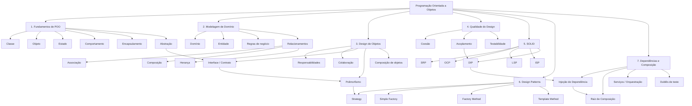

# Mapa Geral de Conceitos — POO II

> **Do objeto ao design de software**

Ao longo dos quatro primeiros módulos, vários conceitos apareceram em momentos diferentes. Alguns foram apresentados diretamente; outros foram utilizados na prática antes de receberem uma definição formal.

Este mapa reúne esses conceitos em uma visão única.

A ideia não é introduzir novos conteúdos. É **organizar o que já foi aprendido**.

---

## O mapa em uma visão



---

# 1. Fundamentos de POO

**Pergunta:** *O que significa representar um problema por meio de objetos?*

- Programação Orientada a Objetos
- Classe
- Objeto
- Estado
- Comportamento
- Identidade
- Abstração
- Encapsulamento
- Invariante
- Imutabilidade
- Objeto rico
- Objeto anêmico

### Ideia central

Um objeto não é apenas um conjunto de dados. Ele representa um conceito e pode proteger seu estado e concentrar os comportamentos relacionados a esse conceito.

**Estudado principalmente:** Módulos 1 e 2.

---

# 2. Modelagem de Domínio

**Pergunta:** *O que deve existir no modelo do software?*

- Domínio
- Modelagem de domínio
- Entidade
- Identidade
- Regra de negócio
- Responsabilidade
- Associação
- Agregação
- Composição
- Herança
- Estado e transições

### Ideia central

Antes de escrever código, precisamos compreender o problema, identificar seus conceitos relevantes e decidir como eles se relacionam.

**Estudado principalmente:** Módulos 1 e 2.

---

# 3. Design de Objetos

**Pergunta:** *Como distribuímos responsabilidades e fazemos os objetos colaborarem?*

- Responsabilidade
- Colaboração entre objetos
- Separação de responsabilidades
- Abstração
- Interface
- Contrato
- Polimorfismo
- Composição de objetos
- Serviço de aplicação/orquestração

### Ideia central

Projetar objetos é decidir quem conhece o quê, quem faz o quê e como os objetos colaboram sem assumir responsabilidades que pertencem a outros conceitos.

**Estudado principalmente:** Módulos 1 a 4.

---

# 4. Qualidade do Design

**Pergunta:** *Como percebemos se a distribuição de responsabilidades está saudável?*

- Coesão
- Acoplamento
- Separação de responsabilidades
- Dependências concretas
- Dependência de abstrações
- Extensibilidade
- Substituibilidade
- Testabilidade

### Duas ideias fundamentais

**Alta coesão:** responsabilidades relacionadas ficam juntas.

**Baixo acoplamento:** elementos não dependem desnecessariamente dos detalhes uns dos outros.

Essas ideias não são uma fórmula matemática para avaliar qualquer código. São direções importantes para decisões de design.

**Estudado principalmente:** Módulos 1 a 4.

---

# 5. SOLID

**Pergunta:** *Quais princípios ajudam a orientar decisões de design orientado a objetos?*

| Princípio | Ideia central |
|---|---|
| **S — Single Responsibility** | Uma classe deve ter uma responsabilidade bem definida. |
| **O — Open/Closed** | Buscar extensão sem modificações desnecessárias do código existente. |
| **L — Liskov Substitution** | Subtipos devem respeitar o contrato esperado do tipo-base. |
| **I — Interface Segregation** | Clientes não devem depender de interfaces que não utilizam. |
| **D — Dependency Inversion** | Depender de abstrações em vez de ficar preso a detalhes concretos. |

### Importante

SOLID não é uma coleção de Design Patterns.

São **princípios de projeto** que ajudam a avaliar e orientar a estrutura do software.

**Estudado principalmente:** Módulos 3 e 4, com diferentes princípios aparecendo conforme os problemas de design surgiram.

---

# 6. Design Patterns

**Pergunta:** *Existe um problema de design recorrente para o qual uma estrutura conhecida pode ser útil?*

## Strategy

**Problema:** um comportamento ou algoritmo pode variar.

**Ideia:** encapsular cada variação em um objeto que segue um contrato comum.

**No curso:** desconto e frete.

## Simple Factory

**Problema:** diferentes pontos do sistema precisam decidir qual objeto concreto criar.

**Ideia:** concentrar a decisão de criação em um lugar específico.

**No curso:** formas de pagamento e notificações.

## Factory Method

**Problema:** existe um fluxo geral de criação, mas a implementação concreta depende da subclasse.

**Ideia:** deixar a subclasse decidir qual objeto criar.

**No curso:** meios de entrega e expedidores.

## Template Method

**Problema:** existe um algoritmo com estrutura comum, mas algumas etapas variam.

**Ideia:** manter o fluxo geral na classe-base e permitir que etapas específicas sejam especializadas.

### Regra importante

> **Primeiro identifique o problema; depois considere o padrão.**

Padrões não são objetivos. Eles são ferramentas.

**Estudado principalmente:** Módulos 3 e 4.

---

# 7. Dependências e Composição

**Pergunta:** *Quem cria, fornece e conecta os objetos que colaboram no sistema?*

- Dependência
- Dependência concreta
- Abstração
- Injeção de Dependência
- Injeção por construtor
- Injeção por método
- Injeção por setter
- Raiz de composição
- Serviço de aplicação/orquestração
- Dublês de teste
- Testabilidade

### Ideia central

Um objeto não precisa criar internamente todos os colaboradores de que depende.

Podemos fornecer suas dependências de fora e concentrar a montagem do grafo de objetos em um ponto de composição.

Isso reduz acoplamento, facilita substituições e melhora a testabilidade.

**Estudado principalmente:** Módulo 4.

---

# Como os blocos se conectam

Uma maneira de contar a história da disciplina é:

```text
1. O que existe no problema?
        ↓
   Domínio e modelagem
        ↓
2. Quais objetos representam esses conceitos?
        ↓
   Classes, objetos, estado e comportamento
        ↓
3. Quem é responsável por cada coisa?
        ↓
   Responsabilidades e encapsulamento
        ↓
4. Como os objetos colaboram?
        ↓
   Associação, composição e colaboração
        ↓
5. O que varia?
        ↓
   Abstração, interfaces e polimorfismo
        ↓
6. Como isolar essas variações?
        ↓
   Strategy e outros padrões
        ↓
7. Quem cria os objetos?
        ↓
   Factories e Factory Method
        ↓
8. Quem fornece as dependências?
        ↓
   Injeção de Dependência
        ↓
9. Como manter tudo substituível e testável?
        ↓
   Baixo acoplamento + alta coesão + composição
```

---

# O mapa em uma frase

> **Programar orientado a objetos é modelar conceitos e responsabilidades como objetos que colaboram entre si; projetar bem esses objetos significa controlar suas responsabilidades, relações, variações e dependências.**

---

# Perguntas para revisar a disciplina

Ao revisar POO II, tente responder sem consultar o material:

1. O que diferencia uma classe de um objeto?
2. O que compõe o estado de um objeto?
3. O que significa dizer que um objeto possui comportamento?
4. O que é encapsulamento de verdade?
5. O que é uma invariante?
6. O que é uma entidade?
7. Qual a diferença entre associação e composição?
8. Quando uma relação de herança representa uma boa abstração?
9. O que significa atribuir uma responsabilidade a um objeto?
10. O que são coesão e acoplamento?
11. Por que abstrações podem reduzir acoplamento?
12. O que é polimorfismo?
13. Qual problema o Strategy resolve?
14. Qual problema uma Factory resolve?
15. Qual a diferença entre Simple Factory e Factory Method?
16. O que é Template Method?
17. Por que criar dependências dentro de uma classe pode ser um problema?
18. O que é Injeção de Dependência?
19. O que é uma raiz de composição?
20. Como SOLID se relaciona com as decisões de design estudadas?

---

# Onde cada módulo se encaixa

| Módulo | Pergunta principal | Conceitos que ganham destaque |
|---|---|---|
| **1 — Construindo o domínio** | O que existe no problema e quem é responsável? | Domínio, objetos, classes, encapsulamento, responsabilidades, associação, composição |
| **2 — Evoluindo o domínio** | Como objetos protegem seu estado e colaboram? | Invariantes, estados, transições, regras de negócio, colaboração |
| **3 — Estratégias** | Como representar comportamentos que variam? | Interfaces, contratos, polimorfismo, Strategy, Open/Closed |
| **4 — Criando Objetos** | Como controlar criação e dependências? | Factories, Factory Method, Template Method, DI, raiz de composição |

---

## E agora?

Este mapa representa **o que foi consolidado até o final do Módulo 4**.

Os próximos módulos podem acrescentar novos conceitos ao mapa sem apagar os anteriores. A ideia é que, ao final da disciplina, este documento seja a visão geral de tudo o que foi estudado em POO II.
