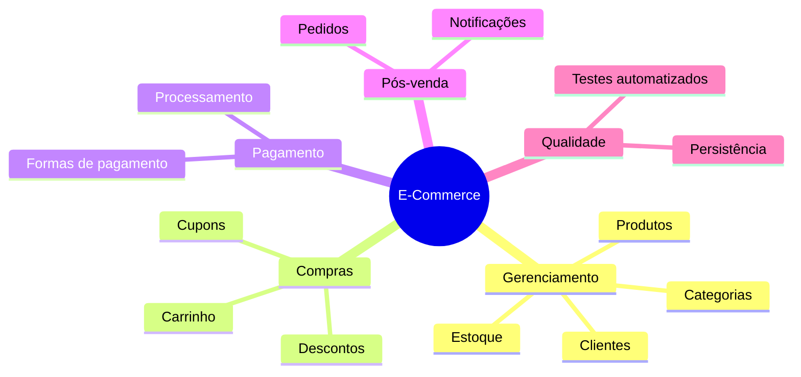
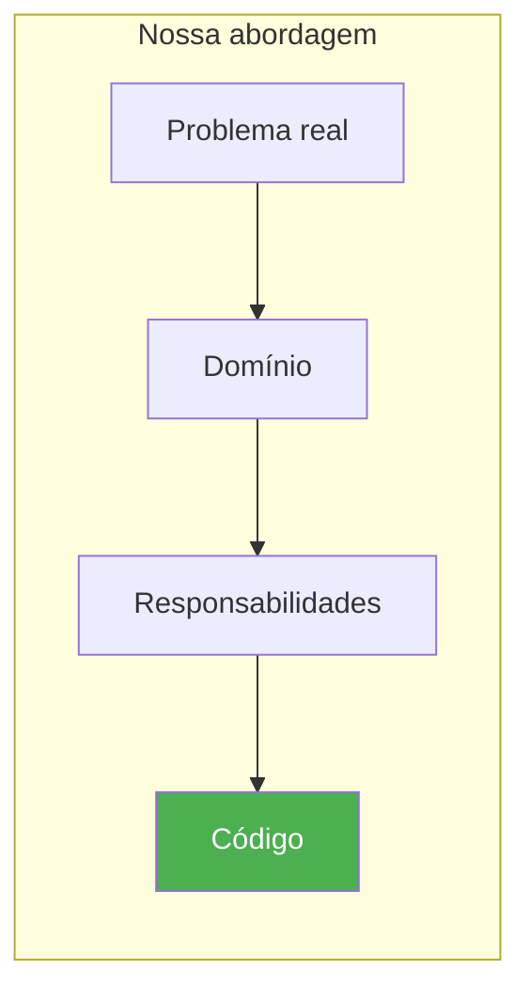
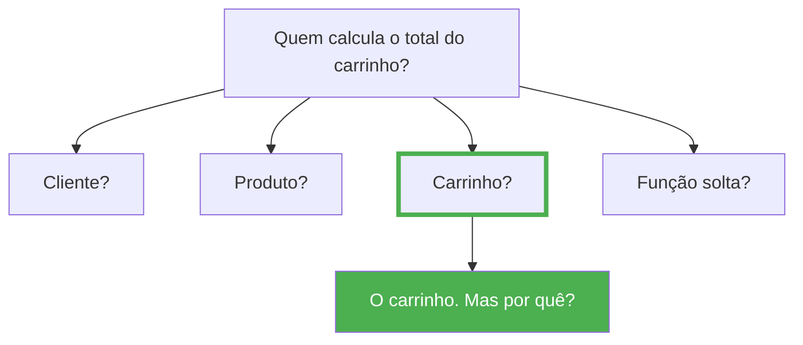
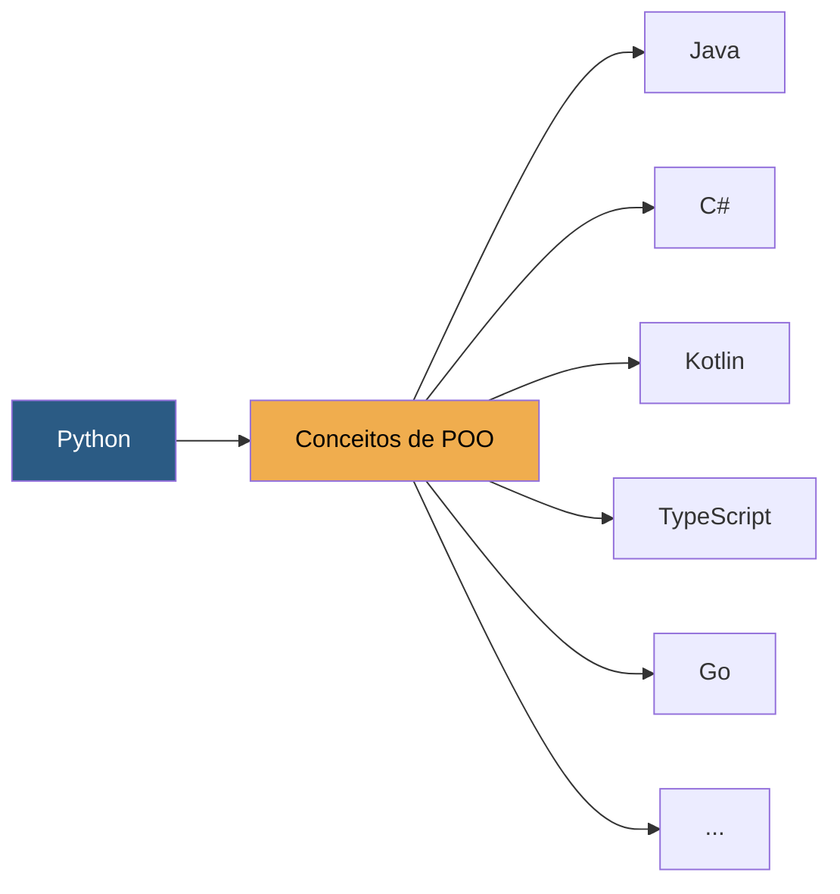

# Capítulo 1 — O que significa projetar software

Imagine que uma loja virtual precise calcular o valor total do carrinho de compras. Onde esse cálculo deveria acontecer?

- Na classe `Produto`?
- Na classe `Cliente`?
- Na classe `Pedido`?
- Na classe `Carrinho`?
- Em uma função separada?
- Em um serviço?

Todas essas alternativas são tecnicamente possíveis. Entretanto, apenas algumas delas conduzem a um projeto organizado e de fácil manutenção.

!!! warning "Reflexão importante"

    **As primeiras linhas de código de um projeto são as mais caras.** Quando escolhemos mal as responsabilidades das classes, criamos dependências desnecessárias ou utilizamos abstrações inadequadas, esses problemas tendem a acompanhar o projeto durante meses ou até anos.

Durante este livro aprenderemos a tomar esse tipo de decisão utilizando princípios consolidados da Engenharia de Software.

## Nossa primeira preocupação: modelar o domínio

Antes de escrever qualquer linha de código precisamos responder algumas perguntas:

- O que existe dentro de um E-Commerce?
- Quais objetos fazem parte desse sistema?
- Quais deles possuem comportamento próprio?
- Quais apenas armazenam informações?
- Quais dependem uns dos outros?
- Quais podem existir sozinhos?

Responder corretamente essas perguntas costuma ser muito mais importante do que escrever rapidamente centenas de linhas de código. Um projeto bem modelado tende a evoluir naturalmente. Um projeto mal modelado costuma acumular problemas a cada nova funcionalidade.

---

## O projeto principal

Vamos começar com uma história.

> A universidade decidiu criar uma loja virtual para vender produtos institucionais. Camisetas, canecas, moletons com o logo da instituição. Inicialmente o sistema será simples: os alunos poderão navegar pelos produtos, adicionar itens a um carrinho e finalizar a compra. Mas sabemos que esse sistema crescerá. No futuro precisará de categorias, descontos, formas de pagamento, controle de estoque, notificações.

É justamente essa história que guiará todo o curso. Não construiremos um sistema genérico. Construiremos um sistema que **evolui** exatamente como um software real. A cada módulo, uma nova necessidade surge — e com ela, um novo conceito de projeto.

Nosso sistema de E-Commerce será desenvolvido gradualmente. Não começaremos implementando dezenas de funcionalidades.



Cada recurso será implementado aos poucos, servindo como contexto para introduzir novos conceitos.

---

## O projeto individual

Enquanto desenvolvemos o E-Commerce, cada estudante desenvolverá **outro sistema**: um **Sistema de Controle Financeiro Pessoal**.

!!! tip "Objetivo do projeto individual"

    O objetivo não é copiar o projeto do professor. Pelo contrário. O objetivo é aplicar os mesmos princípios aprendidos em um domínio completamente diferente.

Essa estratégia possui três vantagens:

1. **Evita a reprodução mecânica** — você não apenas reproduz o código apresentado
2. **Exige análise própria** — cada estudante precisa analisar um novo problema antes de decidir como implementar sua solução
3. **Verifica o aprendizado** — permite verificar se os conceitos realmente foram compreendidos

Sempre que um novo conceito for apresentado no E-Commerce, você deverá identificar como aquele mesmo conceito pode ser aplicado ao sistema financeiro. Ao final do livro, teremos **dois sistemas diferentes**, mas desenvolvidos utilizando os **mesmos princípios de projeto**.

??? question "Possíveis funcionalidades do sistema financeiro"

    - Controle de receitas e despesas
    - Categorias de gastos
    - Orçamento mensal
    - Metas de economia
    - Relatórios por período
    - Cartões de crédito e faturas
    - Investimentos

Nossa abordagem segue esta sequência:

<div style="text-align: center;">



</div>

Sempre partiremos de um **problema do mundo real**. Primeiro entenderemos o domínio. Depois identificaremos responsabilidades. Somente então escreveremos código.

> **Quem deveria ser responsável por executar esta regra de negócio?**

Essa pergunta parece simples. Entretanto, ela está presente em praticamente todas as decisões de projeto.

---

## Antes de começar: o que faz uma boa orientação a objetos?

Antes de modelarmos nosso E-Commerce, precisamos alinhar alguns fundamentos. Você provavelmente já viu esses conceitos antes. A diferença é que, neste livro, não vamos tratá-los como definições a decorar — vamos usá-los como **ferramentas de decisão**.

### Objetos representam conceitos do domínio

```python
class Produto:
    pass

class Cliente:
    pass

class Carrinho:
    pass
```

Esses nomes não foram escolhidos por acaso. Eles fazem parte da linguagem utilizada pelas pessoas que trabalham em uma loja virtual.

!!! tip "A linguagem do domínio"

    Sempre que possível, nossas classes devem representar conceitos reais do domínio. Quando um especialista da área conversa com um desenvolvedor, ambos deveriam compreender o significado dessas classes.

    Se começarmos a criar classes chamadas `Processador123`, `UtilitarioGlobal` ou `SistemaManager`, provavelmente estamos nos afastando da linguagem do domínio.

### Classes existem para representar comportamento

Um erro comum é imaginar que uma classe serve apenas para armazenar dados:

```python
class Produto:

    def __init__(self) -> None:
        self.nome = ""
        self.preco = 0
```

Essa classe funciona como um dicionário. Ela não possui comportamento.

Agora imagine um produto que sabe responder perguntas sobre si mesmo:

```python
produto.esta_disponivel()
produto.aplicar_desconto(10)
produto.alterar_preco(1500)
produto.aumentar_preco(5)
```

Agora estamos começando a utilizar objetos da maneira como foram concebidos. Objetos possuem **estado**, mas também possuem **comportamento**. Muitas vezes o comportamento é mais importante que os próprios atributos.

### Objetos ricos e objetos anêmicos

Este é um conceito que aparecerá diversas vezes durante o curso.

=== "Objeto anêmico"

    ```python
    class Produto:

        def __init__(self, nome: str, preco: float) -> None:
            self.nome = nome
            self.preco = preco
    ```
    
    Apenas armazena dados. Sem comportamento relevante.
    
    === "Objeto rico"
    
    ```python
    class Produto:
    
        def __init__(self, nome: str, preco: float) -> None:
            self.nome = nome
            self.preco = preco

        def aplicar_desconto(self, percentual: float) -> None:
            ...

        def aumentar_preco(self, percentual: float) -> None:
            ...

        def alterar_preco(self, novo_preco: float) -> None:
            ...

        def esta_disponivel(self) -> bool:
            ...
    ```
    
    Armazena dados **e** sabe agir sobre eles.

??? info "Objeto rico vs. Objeto anêmico"

    | Característica | Objeto Anêmico | Objeto Rico |
    |----------------|----------------|-------------|
    | Contém dados | Sim | Sim |
    | Contém comportamento | Não (ou mínimo) | Sim |
    | Protege suas regras | Não — qualquer um altera os atributos | Sim — oferece métodos específicos |
    | Facilidade de teste | Baixa — lógica espalhada pelo sistema | Alta — comportamento encapsulado |

    ```python
    # Objeto anêmico — regra de desconto fica fora da classe
    class Produto:
        def __init__(self, nome: str, preco: float) -> None:
            self.nome = nome
            self.preco = preco

    def aplicar_desconto(produto: Produto, percentual: float) -> None:
        produto.preco -= produto.preco * (percentual / 100)
    ```

    ```python
    # Objeto rico — regra dentro da própria classe
    class Produto:
        def __init__(self, nome: str, preco: float) -> None:
            self.nome = nome
            self.preco = preco

        def aplicar_desconto(self, percentual: float) -> None:
            if not 0 <= percentual <= 100:
                raise ValueError("Percentual inválido")
            self.preco -= self.preco * (percentual / 100)
    ```

    Perceba que no objeto rico a **regra de negócio** está dentro da própria classe. No anêmico, ela precisaria ser replicada em cada lugar que altera o preço.

??? tip "Quando usar cada um?"

    - **Objetos anêmicos** são aceitáveis em camadas de transferência de dados (DTOs)
    - **Objetos ricos** devem ser a regra na camada de domínio

Ao longo do livro, evitaremos transformar nossas classes em simples estruturas de dados.

### Encapsulamento

Quando falamos em encapsulamento, muitos alunos pensam em atributos privados. Encapsulamento é **muito mais** do que esconder atributos.

Encapsular significa **proteger as regras do objeto**.

```python
# Problema: qualquer parte do sistema pode definir um preço inválido
produto.preco = -500
```

Nosso objeto deveria impedir situações inválidas. Uma alternativa melhor seria oferecer operações específicas:

```python
produto.alterar_preco(1500)
produto.aplicar_desconto(10)
```

Perceba a diferença. Não estamos apenas escondendo atributos. Estamos protegendo as regras do negócio.

!!! warning "Getters e setters não são encapsulamento"

    Muitos desenvolvedores acreditam que encapsular é criar `getters` e `setters` para cada atributo.

    ```python
    # Isto NÃO é encapsulamento de verdade
    class Produto:

        def __init__(self, preco: float) -> None:
            self._preco = preco

        def get_preco(self) -> float:
            return self._preco

        def set_preco(self, valor: float) -> None:
            self._preco = valor
    ```

    Este setter permite qualquer valor, inclusive negativo. É um acesso direto disfarçado.

O que realmente importa não é se o atributo é público ou privado — é se o objeto oferece **operações que fazem sentido para o domínio**. Um produto não deveria permitir "definir preço" genericamente; ele deveria permitir `alterar_preco`, `aplicar_desconto`, `aumentar_preco`.

Aqui surge um conceito importante: **invariante**. Invariante é uma condição que deve ser sempre verdadeira para um objeto. Um `Produto` pode ter como invariante que seu preço seja sempre positivo. Cabe ao próprio objeto garantir que suas invariantes nunca sejam violadas.

??? tip "Regra prática"

    Se um `setter` apenas atribui o valor sem nenhuma validação ou regra, ele não está encapsulando nada. Um atributo público direto teria o mesmo efeito.

!!! success "Princípio"

    **Cada objeto é responsável por manter seu próprio estado válido.**

### Responsabilidade: a pergunta mais importante

Talvez esta seja a ideia mais importante de todo o livro.

> **De quem é esta responsabilidade?**



Quem conhece todos os itens adicionados? O carrinho. Logo, ele é quem possui as informações necessárias para realizar esse cálculo.

Esse tipo de raciocínio será repetido dezenas de vezes durante o livro.

---

## Uma última reflexão antes de prosseguir

Talvez você tenha percebido algo interessante: nós ainda não escrevemos uma única linha do sistema. Mesmo assim, já discutimos decisões que influenciarão todo o projeto.

Bons sistemas **não começam pelo código**. Eles começam pelas ideias. Somente quando entendemos bem o problema é que faz sentido escolher como implementá-lo.

---

## Muito além do Python

Embora toda a implementação seja em Python, **este não é um livro sobre Python**. Python será apenas a ferramenta utilizada para implementar as soluções.



Ao aprender a distribuir responsabilidades corretamente entre classes, reduzir acoplamento ou aplicar padrões de projeto, você estará adquirindo conhecimentos que poderão ser utilizados em **Java, C#, Kotlin, TypeScript, Go** e diversas outras linguagens.

!!! info "Foco do livro"

    Discutiremos muito mais **por que determinada solução foi escolhida** do que simplesmente **como escrevê-la em Python**.

---

## Aplicando ao Projeto Financeiro

Antes de prosseguir, pense no sistema que você desenvolverá individualmente.

> Maria recebeu seu salário e precisa organizar as finanças deste mês. Ela quer registrar o salário como receita, categorizar gastos como alimentação, transporte e lazer, definir um limite de gastos para cada categoria, e no fim do mês saber se conseguiu economizar.

Assim como no E-Commerce, essa narrativa nos ajuda a descobrir os objetos do domínio. Algumas perguntas para começar:

- A partir da história da Maria, que objetos você identifica?
- Uma `Conta` representa uma categoria ou uma instituição financeira?
- Um `Lançamento` é uma receita ou uma despesa — ou ambos?
- Quem deveria ser responsável por calcular o total gasto em uma categoria?
- O que uma `Conta` deveria saber fazer? Ela apenas armazena dados ou possui comportamento?

Experimente listar as primeiras classes do sistema financeiro antes de prosseguir para o próximo capítulo. No Capítulo 2 faremos o mesmo exercício com o E-Commerce.

---

No próximo capítulo vamos explorar o domínio do nosso E-Commerce — entender como uma loja virtual realmente funciona antes de modelar qualquer classe.
