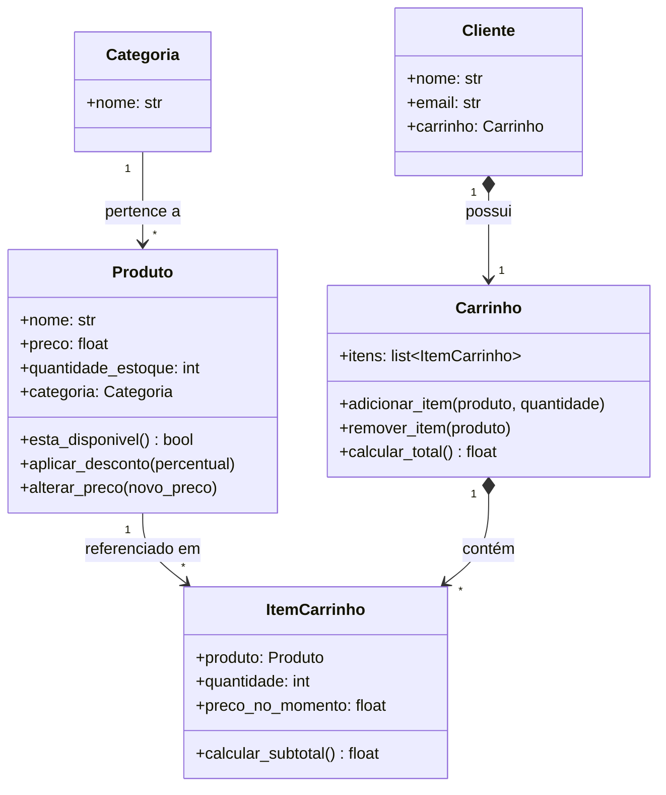
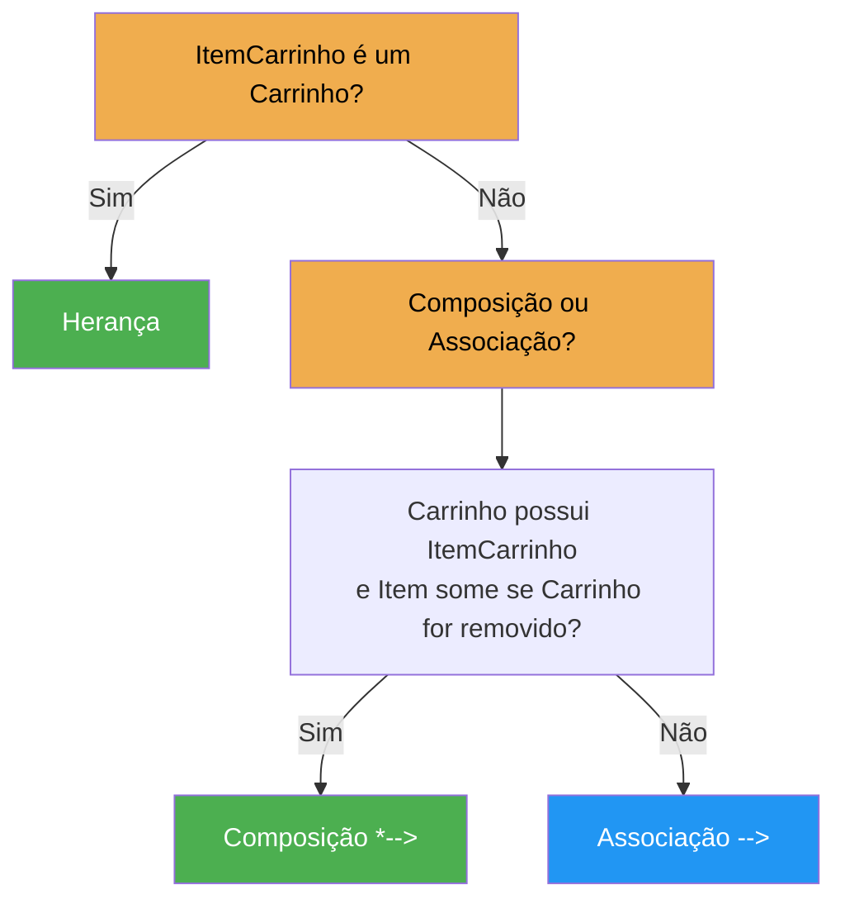

# Capítulo 3 — Primeiras entidades e relacionamentos

!!! info "Situação da Empresa"

    Já conhecemos o domínio do nosso E-Commerce: identificamos as entidades, entendemos o fluxo de uma compra e discutimos como uma loja virtual funciona. Agora é hora de organizar esse conhecimento em um modelo.

    A empresa precisa de um projeto claro antes de começar a implementação. Nosso objetivo neste capítulo é definir as classes, seus atributos, métodos e — principalmente — como elas se relacionam.

Já compreendemos por que o domínio importa e conhecemos os conceitos do nosso E-Commerce através da história do João. Agora é hora de modelar as primeiras entidades.

## Primeira versão do nosso modelo

Nossa primeira versão será propositalmente simples. Teremos apenas cinco classes. Ainda não teremos pedidos, estoque, pagamentos, cupons ou notas fiscais. Essas funcionalidades serão adicionadas nos próximos módulos.



??? info "Os símbolos do diagrama (guia de consulta rápida)"

    | Símbolo | Nome | Significado |
    |---------|------|-------------|
    | `-->` | **Associação** | A classe **conhece** a outra, mas ambas existem independentemente |
    | `o-->` | **Agregação** | A classe **possui** a outra, mas a parte **pode existir sem o todo** |
    | `*-->` | **Composição** | A classe **contém** a outra; a parte **não existe sem o todo** |
    | `<|--` | **Herança** | A subclasse **é um** tipo da superclasse |

    Identifique no diagrama: `Categoria --> Produto` é associação (produto existe sem categoria? Sim, ele poderia ficar sem categoria). `Carrinho *--> ItemCarrinho` é composição (item existe sem carrinho? Não). Essa distinção será importante mais adiante.

!!! info "Lições importantes"

    É importante aprender uma lição logo no início: **software evolui**. Não existe obrigação de modelar todo o sistema antes de começar. Modelaremos apenas o suficiente para resolver o problema atual.

!!! tip "Simplificação nesta versão"

    Você notou que `Produto` possui `quantidade_estoque`? Nesta primeira versão mantivemos a quantidade no próprio produto por simplicidade. Futuramente veremos que o estoque merece uma classe própria com regras específicas — mas isso ficará para um módulo mais adiante.

---

## Um produto conhece seu carrinho?

Imagine um produto chamado "Notebook Gamer". Ele precisa saber em quais carrinhos ele foi colocado?

**Não.** O produto existe independentemente dos clientes. Logo, ele não deve armazenar uma lista de carrinhos. Essa decisão reduz o **acoplamento** entre as classes.

```python
# Correto: Produto não sabe quem o colocou no carrinho
class Produto:

    def __init__(self, nome: str, preco: float, quantidade_estoque: int, categoria: "Categoria") -> None:
        self.nome = nome
        self.preco = preco
        self.quantidade_estoque = quantidade_estoque
        self.categoria = categoria  # Sabe sua categoria, mas não seus carrinhos

    def esta_disponivel(self) -> bool:
        return self.quantidade_estoque > 0
```

---

## Um carrinho conhece seus produtos?

**Sim.** O carrinho precisa saber quais itens foram adicionados. Portanto, faz sentido que ele possua uma coleção de itens. Essa é uma relação natural do domínio.

```python
class Carrinho:

    def __init__(self) -> None:
        self.itens = []  # O carrinho conhece seus itens

    def adicionar_item(self, produto: "Produto", quantidade: int) -> None:
        ...
```

---

## Produto ou Item do Carrinho?

🧠 **Pense:** se você precisasse representar a quantidade de cada produto dentro do carrinho, como faria? Uma lista simples de `Produto` seria suficiente?

Essa costuma ser uma dúvida muito comum. Por que não armazenar diretamente uma lista de produtos dentro do carrinho?

```python
class Carrinho:

    def __init__(self) -> None:
        self.produtos = []  # Problema: como representar quantidade?
```

Parece funcionar, mas imagine que o cliente adicione **três unidades do mesmo produto**. Como representaríamos a quantidade? Talvez repetindo o produto três vezes. Isso gera diversos problemas.

Além disso, imagine que seja necessário registrar o preço do produto **no momento da compra**. E se o preço mudar amanhã?

Percebemos então que existe um **novo conceito** no domínio. Não é apenas um produto. É um **produto dentro do carrinho**. Esse conceito possui informações próprias:

- Produto
- Quantidade
- Preço no momento da inclusão
- Subtotal

Portanto, ele merece uma classe própria: **ItemCarrinho**.

!!! tip "Princípio importante"

    Quando um relacionamento começa a possuir informações próprias, ele normalmente merece se transformar em um **objeto**.

---

Vamos testar esse raciocínio com outra história:

> Maria entrou em uma loja virtual, adicionou dois livros ao carrinho, depois removeu um deles, aplicou um cupom de 10% e finalizou a compra pagando com boleto bancário.

As entidades que surgem são as mesmas: Cliente, Produto, Carrinho, ItemCarrinho, Cupom, Pedido, Pagamento. A estrutura do modelo não mudou — apenas os valores específicos da narrativa.

---

## De que tipo é cada relacionamento?

🧠 **Pense:** qual tipo de relação existe entre `Carrinho` e `ItemCarrinho`? Herança? Composição? Associação? Use o que aprendeu sobre "é um" vs. "faz parte de".

Agora que modelamos as entidades, precisamos decidir que tipo de relação existe entre elas. Observe as classes `Carrinho` e `ItemCarrinho`. Seria correto fazer?

```python
class ItemCarrinho(Carrinho):  # ERRADO!
    ...
```

**Não.** Um item do carrinho **não é um carrinho**. Ele **faz parte** de um carrinho. Temos uma relação de **composição**, e não de herança.

??? danger "Erro comum entre iniciantes"

    Este é um erro muito comum. Uma regra prática bastante utilizada é perguntar:

    > Podemos dizer que "ItemCarrinho **é um** Carrinho"?

    **Não.** Então herança não faz sentido.

    Agora pergunte:

    > Um Carrinho **possui vários** ItemCarrinho?

    **Sim.** Logo, composição representa melhor essa relação.

O fluxograma abaixo ajuda a decidir qual tipo de relação usar em cada caso:



### Exemplos práticos no E-Commerce

| Situação | Pergunta | Resposta | Relação | Símbolo UML |
|----------|----------|----------|---------|-------------|
| `ItemCarrinho` e `Carrinho` | Item é um Carrinho? | Não | Composição | `*-->` |
| `ItemCarrinho` e `Produto` | ItemCarrinho é um Produto? | Não | Associação | `-->` |
| `Categoria` e `Produto` | Categoria é um Produto? | Não | Associação | `-->` |
| `Carrinho` e `Cliente` | Carrinho é um Cliente? | Não | Composição | `*-->` |
| `ProdutoFisico` e `Produto` | ProdutoFisico é um Produto? | Sim | Herança | `<|--` |
| `ProdutoDigital` e `Produto` | ProdutoDigital é um Produto? | Sim | Herança | `<|--` |

---

## Composição no nosso modelo

Volte ao diagrama de classes do início deste capítulo. Observe os relacionamentos com losango preenchido (`*-->`):

- `Cliente *--> Carrinho` — o carrinho não existe sem o cliente
- `Carrinho *--> ItemCarrinho` — o item não existe sem o carrinho

Esses são relacionamentos de **composição** (todo-parte). As demais setas no diagrama são **associação** simples (referência).

!!! tip "Regra prática para o curso"

    Durante este curso, **composição será utilizada muito mais frequentemente do que herança**, refletindo uma prática comum em projetos modernos. A herança será reservada para casos onde realmente existe uma relação "é um" clara e benéfica para o projeto.

---

## Discussão de projeto

Antes de escrever qualquer código, responda às perguntas abaixo. Não existe problema em errar. Nosso objetivo é justamente aprender a pensar sobre projeto.

??? question "1. Quem deveria calcular o subtotal de um item do carrinho?"

    - `Produto`?
    - `Carrinho`?
    - `ItemCarrinho`?

    **Resposta:** O `ItemCarrinho` conhece seu produto, sua quantidade e o preço no momento da compra. Ele possui todas as informações necessárias para calcular `preco * quantidade`. Essa responsabilidade é naturalmente dele.

??? question "2. Quem deveria calcular o valor total da compra?"

    - `Cliente`?
    - `Produto`?
    - `Carrinho`?
    - `Categoria`?

    **Resposta:** O `Carrinho` conhece todos os seus itens. Para calcular o total, ele pode iterar sobre os itens e somar os subtotais. Essa é uma responsabilidade clara do carrinho.

??? question "3. Quem deveria conhecer a quantidade de um produto comprado?"

    - `Produto`?
    - `Cliente`?
    - `ItemCarrinho`?

    **Resposta:** O `ItemCarrinho`. A quantidade é uma informação intrínseca do item no carrinho. O `Produto` não sabe quantas unidades foram adicionadas — ele apenas define o preço unitário.

??? question "4. Um cliente pode possuir mais de um carrinho?"

    Pense em situações como:
    
    - Carrinho salvo para depois
    - Compra recorrente
    - Listas de desejos
    - Múltiplas sessões

    **Reflexão:** Nossa modelagem atual prevê **um** carrinho por cliente. Mas será que isso será suficiente? Será que nossa modelagem precisará evoluir futuramente? Essa é exatamente a natureza iterativa do design de software.

---

## Exercícios

### Nível 1 — Fixação

1. No diagrama de classes do início deste capítulo, identifique quais relacionamentos são de **composição** e quais são de **associação**. Justifique cada escolha.
2. Adicione um atributo `descricao: str` à classe `Produto` e explique por que ele pertence a essa classe.

### Nível 2 — Aplicação

3. Modele o relacionamento entre `Cliente` e `Endereco`. Cada cliente pode ter um ou mais endereços (entrega, cobrança). É composição ou associação? Justifique.
4. Imagine que o carrinho precise registrar a data em que cada item foi adicionado. Onde esse atributo deveria ficar? Por quê?

### Nível 3 — Desafio

5. No sistema financeiro, identifique um relacionamento que poderia ser modelado como composição. Pense em uma `Carteira` que contém `Investimentos`, ou um `Orçamento` que contém `CategoriasDeGasto`. Modele esse relacionamento e justifique sua escolha.

---

## Aplicando ao Projeto Financeiro

No E-Commerce, uma classe própria (`ItemCarrinho`) surgiu porque a simples lista de `Produto` não era suficiente — precisávamos de quantidade e preço no momento da compra. Existe alguma situação semelhante no sistema financeiro, onde um relacionamento simples entre dois objetos precisaria se tornar uma classe própria?

Analise também os relacionamentos do sistema financeiro: uma `Carteira` **contém** `Investimentos` ou apenas os **referencia**? Um `Orçamento` **possui** `CategoriasDeGasto` ou apenas as **lista**? Justifique cada decisão com base no que aprendeu sobre composição e associação.

---

## 📌 Resumo

- **Composição** (`*-->`) representa relação todo-parte: a parte não existe sem o todo
- **Associação** (`-->`) representa conhecimento: os objetos existem independentemente
- **Herança** só deve ser usada quando existe uma relação "é um" clara
- Quando um relacionamento começa a possuir informações próprias, ele merece virar uma classe
- As principais decisões de projeto são sobre **responsabilidade**: cada classe deve fazer apenas o que lhe compete

## O que vem a seguir

Agora que entendemos melhor o domínio, modelamos as primeiras entidades e aprendemos a diferenciar composição de herança, começaremos finalmente a escrever código. Mas faremos isso com uma preocupação constante: **cada classe deverá possuir uma responsabilidade clara**.

Não criaremos classes apenas porque "parece necessário". Cada atributo, método e relacionamento será justificado com base no domínio do problema e nos princípios da Programação Orientada a Objetos.

```python
# O que está por vir...
class Produto:

    def __init__(self, nome: str, preco: float, categoria: "Categoria") -> None:
        self.nome = nome
        self.preco = preco
        self.categoria = categoria
        self.disponivel = True

    def aplicar_desconto(self, percentual: float) -> None:
        if not 0 <= percentual <= 100:
            raise ValueError("Percentual deve estar entre 0 e 100")
        self.preco -= self.preco * (percentual / 100)
```

No próximo módulo iniciaremos a implementação completa do nosso sistema.
