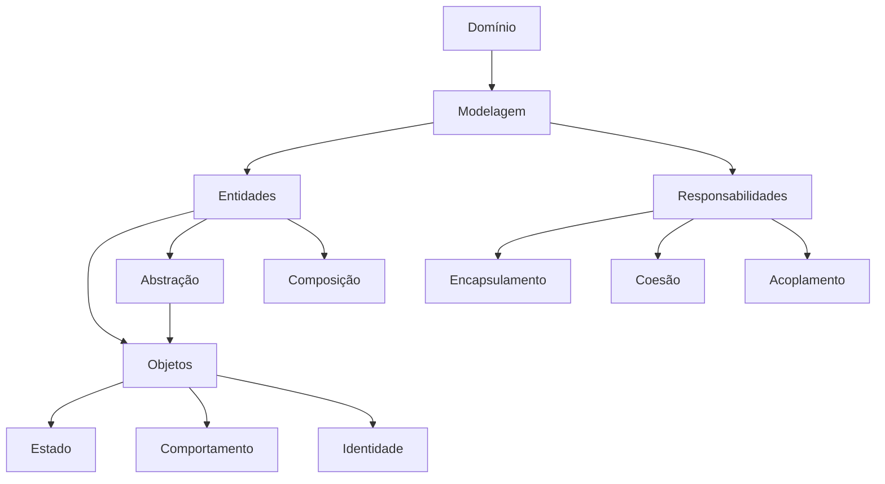

# Mapa de Conhecimento — Módulo 1

> **De uma classe para um modelo de domínio**

Este mapa reúne os conceitos que apareceram no primeiro módulo. Ele não substitui os capítulos: serve para mostrar como as ideias estudadas se relacionam.

## O que entrou neste módulo

### Fundamentos de POO

- **Programação Orientada a Objetos (POO)** — é um paradigma de programação no qual o software é estruturado a partir de objetos que representam conceitos relevantes do problema e colaboram entre si para realizar as operações do sistema. 

- **Classe** — é uma definição que descreve características e comportamentos que seus objetos podem possuir. A classe representa uma abstração. Por exemplo, `Produto` representa o conceito de produto, enquanto um determinado notebook cadastrado é uma instância desse conceito. 

      Uma classe pode definir:
      
      - estado;
      - operações;
      - regras;
      - relacionamentos com outros objetos.

- **Objeto** — é instância concreta de uma classe. Se `Produto` é uma classe, um determinado notebook é um objeto. Dois objetos da mesma classe podem possuir estados diferentes. 

      Por exemplo:

      ```
      Produto A
      nome = "Notebook"
      preço = 3500
      estoque = 10
      
      Produto B
      nome = "Mouse"
      preço = 150
      estoque = 20
      ```

      Os dois são produtos, mas representam objetos diferentes.

- **Estado** — informações que caracterizam um objeto em determinado momento, determinada pelos valores e informações que possui. O estado pode mudar durante a execução do sistema. O Pedido, por exemplo, pode passar por estados como: CRIADO, PAGO, ENVIADO, ENTREGUE, etc. 

      O estado não é apenas uma informação armazenada. Ele pode determinar o que o objeto pode ou não fazer. Um pedido entregue, por exemplo, não deve aceitar determinadas operações que eram possíveis quando estava criado.

- **Comportamento** — operações e regras que o objeto pode realizar. Por isso, de modo geral, um objeto não deveria ser apenas um simples recipientes de dados. Um Carrinho, por exemplo, não deveria apenas possuir uma lista de itens. Ele possui comportamentos relacionados ao conceito de carrinho:

      - adicionar item;
      - calcular quantidade;
      - calcular total;
      - finalizar;
      - esvaziar.

      O comportamento relacionado a um conceito deve, quando possível, permanecer próximo dos dados e regras desse conceito.

- **Identidade** — aquilo que permite distinguir um objeto de outro, mesmo quando seus valores são semelhantes Dois produtos podem possuir o mesmo nome e o mesmo preço e ainda assim serem objetos diferentes. O mesmo vale para dois pedidos realizados pelo mesmo cliente.

- **Encapsulamento** — é o princípio de proteger o estado e as regras de um objeto, fazendo com que as alterações relevantes ocorram por meio de operações controladas pelo próprio objeto. Encapsulamento não significa simplesmente “deixar atributos privados”. O objetivo é impedir que outras partes do sistema coloquem o objeto em um estado inválido.

      A pergunta importante é:

      > Quem deve garantir que este objeto permaneça válido?

      Normalmente, a resposta é: o próprio objeto que possui a responsabilidade sobre aquele estado.

- **Abstração** — consiste em representar aquilo que é relevante para um determinado contexto, ocultando detalhes que não precisam ser conhecidos por quem utiliza a abstração. A abstração permite que o código dependa de um conceito mais geral, em vez de depender diretamente de uma implementação específica. Esse conceito será melhor explorado nos demais módulos, principalmente quando falarmos de variação de comportamento e criação de objetos, mas já aparece aqui como uma ideia central.

### Modelagem de domínio

- **Domínio** — é o conjunto de conceitos, regras, processos e relações pertencentes ao problema que o software pretende resolver.

      No nosso exemplo, o domínio é o comércio eletrônico. Ele contém (ainda será melhor elaborado) conceitos como:

      - cliente;
      - produto;
      - carrinho;
      - pedido;
      - pagamento;
      - cupom;
      - entrega;
      - frete;
      - notificação.

      Mas o domínio também contém regras:

      - um carrinho vazio não pode ser finalizado;
      - um pedido possui estados;
      - determinadas transições de estado são inválidas;
      - um cupom pode expirar;
      - determinados descontos dependem de regras específicas;
      - uma entrega possui prazo e rastreio.

      Essas regras existem independentemente da linguagem de programação utilizada.

- **Modelagem de domínio** — é o processo de identificar e representar no software os conceitos e regras relevantes de um domínio. Antes de criar classes, é necessário compreender o problema.

      Uma narrativa como:

      > “O cliente coloca produtos no carrinho, finaliza a compra, recebe um pedido, realiza o pagamento e aguarda a entrega”

      pode revelar conceitos e relações importantes. A modelagem não consiste em transformar automaticamente cada substantivo em uma classe. Uma decisão de modelagem deve responder:

      > Este conceito precisa realmente existir como objeto?

      e:

      > Que responsabilidade ele possui?

- **Entidade** — é um objeto do domínio que representa algo relevante para o problema e possui identidade própria. Até aqui, o conceito de entidade não foi explorado em profundidade. Ele será melhor detalhado no Módulo 2, quando o domínio evoluir e novas regras surgirem. Mas já podemos dizer que uma entidade é um objeto que possui identidade própria e comportamento relevante para o domínio. Ela não é apenas um recipiente de dados. Alguns exemplos de entidades do nosso domínio de comércio eletrônico são: Cliente, Produto, Pedido, Cupom e Pagamento.

Reforçando, uma entidade não é simplesmente uma tabela de banco de dados. O conceito pertence ao domínio, e sua representação persistente é uma preocupação posterior.

- **Responsabilidade** — é aquilo que uma classe ou objeto deve conhecer ou fazer dentro do sistema. Uma das perguntas mais importantes que sempre se deve fazer é :

      > De quem é esta responsabilidade?

      Por exemplo:

      - quem calcula o subtotal de um item?
      - quem calcula o total do carrinho?
      - quem controla o estado do pedido?
      - quem cria determinado tipo de pagamento?
      - quem monta uma mensagem?
      - quem envia uma notificação?

A qualidade do projeto depende muito da distribuição dessas responsabilidades. Esse é um conceito que será explorado em todos os módulos seguintes. 

- **Associação** — representa um relacionamento entre objetos que podem existir independentemente. Por exemplo:

      > Produto ───── Categoria

      ou:

      > ItemCarrinho ───── Produto

      O produto não depende da existência daquele item específico para existir. A associação representa principalmente uma relação de conhecimento ou utilização entre objetos.

- **Composição** — representa uma relação todo-parte na qual a existência da parte está fortemente ligada à existência do todo.

      Por exemplo:

      ```
      Carrinho
         │
         ├── ItemCarrinho
         ├── ItemCarrinho
         └── ItemCarrinho
      ```

      Os ItemCarrinho pertencem ao carrinho. O carrinho é responsável por gerenciar essas partes. A composição é diferente de simplesmente possuir uma referência para outro objeto.

- **Agregação** - é uma relação todo-parte mais fraca que a composição. O todo reúne objetos que continuam podendo existir independentemente dele. 

      A distinção entre associação, agregação e composição depende da semântica do domínio e do ciclo de vida dos objetos. Até aqui,  o foco principal foi a diferença entre associação e composição, especialmente para evitar modelagens incorretas.

### Qualidade do design

Esses dois conceitos ainda são iniciais, e melhor explorados nos demais módulos, mas já possuem alguma importância:

- **Coesão** — grau de relacionamento entre as responsabilidades de um mesmo elemento.
- **Acoplamento** — grau de dependência entre elementos do software.

## O mapa até aqui



## A pergunta central do módulo

> **Quem é responsável por isso?**

Essa pergunta será reutilizada nos próximos módulos. À medida que o sistema crescer, as responsabilidades precisarão ser redistribuídas e refinadas.

## O que mudou na forma de pensar

No início, é comum pensar em termos de dados e funções isoladas. Ao final deste módulo, a perspectiva passa a ser:

```text
Problema
   ↓
Domínio
   ↓
Conceitos relevantes
   ↓
Objetos
   ↓
Responsabilidades
   ↓
Colaboração
```

O código é consequência dessas decisões de modelagem.

## Próximo passo

No Módulo 2, o domínio evolui. Novos estados, regras e colaborações obrigarão o modelo a ficar mais preciso.

[Ver o Mapa Geral de Conceitos](../mapa-conceitos.md)
