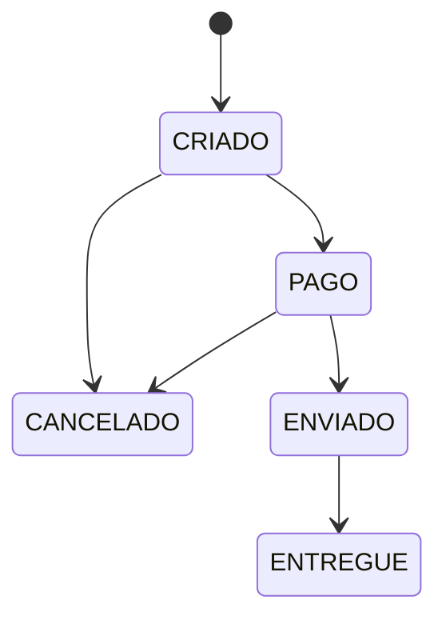

# Capítulo 6 — O ciclo de vida do pedido

!!! info "Situação da Empresa"

    Os pedidos já estão sendo criados. Maria finalmente conseguiu comprar. Mas agora o gerente tem uma nova preocupação: "Qual pedido foi pago? Qual está aguardando pagamento? Qual já foi enviado? Precisamos saber em que situação cada pedido se encontra."

    Atualmente, nosso pedido tem apenas um `_status` armazenado como string. Não há controle sobre quais transições são válidas. O sistema aceitaria, por exemplo, mudar um pedido de "criado" direto para "entregue" — o que não faz sentido.

    Precisamos evoluir o domínio novamente. Desta vez, para incluir **estados** e **regras de transição**.

No capítulo anterior, criamos Pedido com um status simples. Strings são flexíveis, mas também são perigosas: qualquer código externo pode atribuir qualquer valor. Pior, nenhum código externo sabe quais transições são válidas.

Isso nos leva a dois conceitos importantes:

- **Estado**: uma condição em que o objeto se encontra em determinado momento
- **Invariante**: uma regra que nunca pode ser violada, independentemente do estado

Nosso pedido tem uma invariante clara: "um pedido entregue não pode ser cancelado", "um pedido criado não pode ser enviado sem antes ser pago". Precisamos codificar essas regras.

---

## Definindo os estados

Vamos criar uma classe que centraliza os estados possíveis e as transições válidas.

```python title="ecommerce/status_pedido.py" linenums="1"
class StatusPedido:
    CRIADO = "criado"
    PAGO = "pago"
    ENVIADO = "enviado"
    ENTREGUE = "entregue"
    CANCELADO = "cancelado"

    _TRANSIcoES_VALIDAS = {
        CRIADO: [PAGO, CANCELADO],
        PAGO: [ENVIADO, CANCELADO],
        ENVIADO: [ENTREGUE],
        ENTREGUE: [],
        CANCELADO: [],
    }

    @classmethod
    def transicao_valida(cls, de: str, para: str) -> bool:
        return para in cls._TRANSIcoES_VALIDAS.get(de, [])
```

??? question "Por que não usar um `Enum` do Python?"

    Poderíamos usar `enum.Enum` — é uma solução válida. Mas optamos por uma classe com constantes por dois motivos: (1) manter a simplicidade didática, já que `Enum` tem particularidades que desviam o foco; (2) mostrar que uma classe pode servir apenas como espaço de nome para constantes relacionadas.

    Mais adiante no curso, quando introduzirmos padrões como o Strategy, a própria noção de "estado" evoluirá para objetos polimórficos. A solução de hoje não precisa ser a definitiva.

O diagrama abaixo mostra as transições possíveis:



Note que `ENTREGUE` e `CANCELADO` são estados terminais — não possuem transições de saída.

---

## Evoluindo o Pedido com estados

Agora vamos modificar `Pedido` para usar `StatusPedido` e validar transições.

```python title="ecommerce/pedido.py" linenums="1" hl_lines="2 9 20 31-48"
from ecommerce.item_pedido import ItemPedido
from ecommerce.status_pedido import StatusPedido


class Pedido:

    def __init__(self) -> None:
        self._itens: list[ItemPedido] = []
        self._status = StatusPedido.CRIADO

    @property
    def itens(self) -> list[ItemPedido]:
        return list(self._itens)

    @property
    def status(self) -> str:
        return self._status

    def adicionar_item(self, produto: "Produto", quantidade: int) -> None:
        if self._status != StatusPedido.CRIADO:
            raise ValueError("Não é possível adicionar itens a um pedido já finalizado")
        preco_no_momento = produto.preco
        self._itens.append(ItemPedido(produto, quantidade, preco_no_momento))

    def calcular_total(self) -> float:
        return sum(item.calcular_subtotal() for item in self._itens)

    def quantidade_itens(self) -> int:
        return len(self._itens)

    def _transicionar(self, novo_status: str) -> None:
        if not StatusPedido.transicao_valida(self._status, novo_status):
            raise ValueError(
                f"Transicao invalida: {self._status} -> {novo_status}"
            )
        self._status = novo_status

    def pagar(self) -> None:
        self._transicionar(StatusPedido.PAGO)

    def enviar(self) -> None:
        self._transicionar(StatusPedido.ENVIADO)

    def entregar(self) -> None:
        self._transicionar(StatusPedido.ENTREGUE)

    def cancelar(self) -> None:
        self._transicionar(StatusPedido.CANCELADO)
```

!!! tip "🧠 Pense sobre o que acabamos de fazer"

    O método `_transicionar` é privado — começa com `_`. Isso significa que código externo não pode chamá-lo diretamente. Para mudar o estado, é preciso usar um método público com nome significativo: `pagar()`, `enviar()`, `entregar()`, `cancelar()`.

    Isso não é burocracia. É **encapsulamento de regras de negócio**. Se amanhã a regra mudar (por exemplo, "pedidos pagos há mais de 7 dias não podem ser cancelados"), basta alterar o método `cancelar()` sem mexer em mais nada.

---

## Criando o Pagamento

Um pedido precisa ser pago. Mas pagamento não é apenas um estado — é uma entidade com informações próprias: valor, data, confirmação.

```python title="ecommerce/pagamento.py" linenums="1"
from datetime import date


class Pagamento:

    def __init__(self, pedido: "Pedido", valor: float) -> None:
        if valor <= 0:
            raise ValueError("Valor do pagamento deve ser positivo")
        self._pedido = pedido
        self._valor = valor
        self._data = date.today()
        self._confirmado = False

    @property
    def pedido(self) -> "Pedido":
        return self._pedido

    @property
    def valor(self) -> float:
        return self._valor

    @property
    def data(self) -> date:
        return self._data

    @property
    def confirmado(self) -> bool:
        return self._confirmado

    def confirmar(self) -> None:
        if self._confirmado:
            raise ValueError("Pagamento ja foi confirmado")
        self._confirmado = True
```

O Pagamento é propositalmente simples. Ele não conhece formas de pagamento (cartão, boleto, pix) — isso virá em módulos futuros. Neste momento, o importante é entender que **uma nova entidade surgiu porque o domínio evoluiu**.

!!! warning "⚠️ Erro comum — Pagamento como atributo do Pedido"

    Uma tentação é colocar os dados do pagamento diretamente no Pedido: `self.pago = True`, `self.data_pagamento`, `self.valor_pago`. Isso funciona, mas viola coesão — o Pedido passa a conhecer detalhes que não são sua responsabilidade. Separar Pagamento em sua própria classe mantém cada objeto focado em seu papel.

---

## Conectando Pagamento ao Pedido

Agora que Pagamento existe, vamos atualizar `Pedido.pagar()` para criar um Pagamento associado.

```python title="ecommerce/pedido.py" linenums="1" hl_lines="2 11 13-15 21"
from ecommerce.item_pedido import ItemPedido
from ecommerce.pagamento import Pagamento
from ecommerce.status_pedido import StatusPedido


class Pedido:

    def __init__(self) -> None:
        self._itens: list[ItemPedido] = []
        self._status = StatusPedido.CRIADO
        self._pagamento: Pagamento | None = None

    @property
    def pagamento(self) -> Pagamento | None:
        return self._pagamento

    # ... demais métodos ...

    def pagar(self) -> None:
        self._transicionar(StatusPedido.PAGO)
        self._pagamento = Pagamento(self, self.calcular_total())
```

Note que `Pedido.pagar()` faz duas coisas: muda o estado para `PAGO` **e** cria o `Pagamento`. Uma única ação de domínio (pagar) pode envolver múltiplos objetos colaborando.

---

## Testes

```python title="tests/test_status_pedido.py" linenums="1"
from ecommerce.status_pedido import StatusPedido


class TestStatusPedido:

    def test_transicao_valida(self) -> None:
        assert StatusPedido.transicao_valida(StatusPedido.CRIADO, StatusPedido.PAGO) is True
        assert StatusPedido.transicao_valida(StatusPedido.CRIADO, StatusPedido.CANCELADO) is True
        assert StatusPedido.transicao_valida(StatusPedido.PAGO, StatusPedido.ENVIADO) is True
        assert StatusPedido.transicao_valida(StatusPedido.ENVIADO, StatusPedido.ENTREGUE) is True

    def test_transicao_invalida(self) -> None:
        assert StatusPedido.transicao_valida(StatusPedido.CRIADO, StatusPedido.ENTREGUE) is False
        assert StatusPedido.transicao_valida(StatusPedido.CRIADO, StatusPedido.ENVIADO) is False
        assert StatusPedido.transicao_valida(StatusPedido.PAGO, StatusPedido.ENTREGUE) is False
```

```python title="tests/test_pagamento.py" linenums="1"
import pytest
from ecommerce.categoria import Categoria
from ecommerce.pagamento import Pagamento
from ecommerce.pedido import Pedido
from ecommerce.produto import Produto


class TestPagamento:

    def setup_method(self) -> None:
        self.cat = Categoria("Informática")
        self.notebook = Produto("Notebook", 3500.0, 10, self.cat)
        self.pedido = Pedido()
        self.pedido.adicionar_item(self.notebook, 1)

    def test_criar_pagamento(self) -> None:
        pag = Pagamento(self.pedido, 3500.0)
        assert pag.valor == 3500.0
        assert pag.confirmado is False

    def test_confirmar_pagamento(self) -> None:
        pag = Pagamento(self.pedido, 3500.0)
        pag.confirmar()
        assert pag.confirmado is True

    def test_valor_invalido_zero(self) -> None:
        with pytest.raises(ValueError):
            Pagamento(self.pedido, 0)
```

```python title="tests/test_pedido.py" linenums="1"
    def test_pagar(self) -> None:
        pedido = Pedido()
        pedido.adicionar_item(self.notebook, 1)
        pedido.pagar()
        assert pedido.status == "pago"
        assert pedido.pagamento is not None

    def test_enviar(self) -> None:
        pedido = Pedido()
        pedido.adicionar_item(self.notebook, 1)
        pedido.pagar()
        pedido.enviar()
        assert pedido.status == "enviado"

    def test_cancelar_pedido_criado(self) -> None:
        pedido = Pedido()
        pedido.adicionar_item(self.notebook, 1)
        pedido.cancelar()
        assert pedido.status == "cancelado"

    def test_nao_cancelar_pedido_entregue(self) -> None:
        pedido = Pedido()
        pedido.adicionar_item(self.notebook, 1)
        pedido.pagar()
        pedido.enviar()
        pedido.entregar()
        with pytest.raises(ValueError):
            pedido.cancelar()

    def test_transicao_invalida_lanca_erro(self) -> None:
        pedido = Pedido()
        pedido.adicionar_item(self.notebook, 1)
        with pytest.raises(ValueError):
            pedido.enviar()
```

```bash
$ pytest tests/
```

---

## 🧩 Aplicando ao Projeto Financeiro

No módulo anterior, você criou um `Fechamento` para consolidar lançamentos. Agora precisamos de **conciliação**: verificar se os lançamentos debitados em uma conta batem com os creditados em outra.

Assim como validamos transições de estado do Pedido, a conciliação precisa garantir **invariantes** — o total de débitos deve ser igual ao total de créditos em um período.

Sua tarefa:
- Crie uma classe `Conciliacao` que recebe dois conjuntos de lançamentos e verifica se os totais conferem
- Se não conferirem, a conciliação deve falhar com uma mensagem clara
- Decida: a conciliação deve ser uma classe própria ou um método de `Fechamento`?

---

## 📌 Resumo

- **Estado** não é apenas um atributo — é uma condição que rege o comportamento do objeto
- **Invariantes** são regras que nunca podem ser violadas; codificá-las protege a integridade do domínio
- **Transições inválidas** devem ser rejeitadas com exceções claras
- **Pagamento** é uma entidade separada, não um atributo do Pedido — cada classe com sua responsabilidade
- O método privado `_transicionar` centraliza a lógica de validação, preparando o terreno para evoluções futuras

## O que mudou no sistema

- ✔ Pedido agora tem estados definidos e validados
- ✔ StatusPedido centraliza as regras de transição
- ✔ Pagamento existe como classe própria
- ❌ O fluxo completo (carrinho → pedido → pagamento) ainda não está integrado
- ❌ Carrinho não é esvaziado após finalizar

## O que vem a seguir

Temos as peças separadas: carrinho, pedido com estados, pagamento. Mas ainda não há um fluxo contínuo. O cliente precisa chamar vários métodos manualmente. No próximo capítulo, vamos orquestrar tudo em uma experiência coesa de compra.
