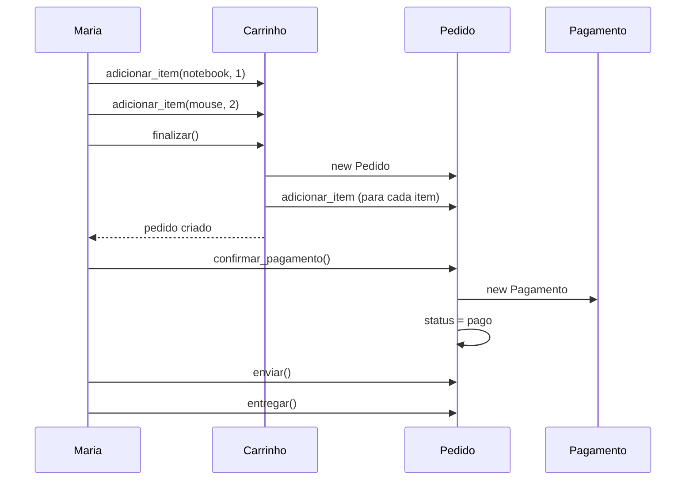

# Capítulo 7 — O fluxo completo de compra

!!! info "Situação da Empresa"

    O sistema já cria pedidos, controla estados e registra pagamentos. Mas ainda não existe um fluxo contínuo. O atendente precisa executar várias operações manuais: finalizar carrinho, criar pedido, registrar pagamento. A empresa quer automatizar esse processo.

    Maria quer entrar no site, clicar em "Finalizar Compra" e ter tudo resolvido. O sistema precisa orquestrar as peças que construímos até aqui.

Este é o capítulo onde tudo se conecta. Vamos construir o fluxo completo de compra, mostrando como objetos colaboram para realizar uma operação de negócio.

---

## O que precisamos

Para que uma compra aconteça do início ao fim, precisamos:

1. Cliente ter um carrinho com itens
2. Finalizar o carrinho, transformando-o em pedido
3. Esvaziar o carrinho (a compra foi concluída)
4. Registrar o pedido na lista do cliente
5. Confirmar o pagamento
6. Avançar o estado do pedido (pago → enviado → entregue)

Alguns desses passos já existem, mas estão espalhados. Precisamos de um método que orquestre os passos 1 a 4 de uma só vez.

---

## Esvaziando o carrinho

Um detalhe importante: depois que o carrinho vira pedido, ele deve ser esvaziado. Caso contrário, o cliente veria os mesmos itens no carrinho mesmo depois de comprar.

```python title="ecommerce/carrinho.py" hl_lines="14-15"
class Carrinho:

    # ... métodos existentes ...

    def finalizar(self) -> Pedido:
        if not self.itens:
            raise ValueError("Carrinho vazio")
        pedido = Pedido()
        for item in self.itens:
            pedido.adicionar_item(item.produto, item.quantidade)
        return pedido

    def esvaziar(self) -> None:
        self.itens.clear()
```

---

## Finalizando a compra no Cliente

O método `finalizar_compra` no Cliente orquestra os passos 1 a 4.

```python title="ecommerce/cliente.py" hl_lines="16-25"
class Cliente:

    def __init__(self, nome: str, email: str) -> None:
        self.nome = nome
        self.email = email
        self.carrinho: "Carrinho | None" = None
        self._pedidos: list["Pedido"] = []

    @property
    def pedidos(self) -> list["Pedido"]:
        return list(self._pedidos)

    def possui_carrinho(self) -> bool:
        return self.carrinho is not None

    def finalizar_compra(self) -> "Pedido":
        if self.carrinho is None:
            raise ValueError("Cliente nao possui carrinho")
        if not self.carrinho.itens:
            raise ValueError("Carrinho vazio")
        pedido = self.carrinho.finalizar()
        self._pedidos.append(pedido)
        self.carrinho.esvaziar()
        return pedido
```

---

## Simplificando o pagamento no Pedido

No capítulo anterior, o método `pagar()` mudava o estado e criava o `Pagamento`. Agora vamos unificar isso em `confirmar_pagamento()`, que faz tudo em um passo: valida a transição, cria o pagamento e o confirma.

```python title="ecommerce/pedido.py" hl_lines="43-46"
class Pedido:

    # ... outros métodos ...

    def _transicionar(self, novo_status: str) -> None:
        if not StatusPedido.transicao_valida(self._status, novo_status):
            raise ValueError(
                f"Transicao invalida: {self._status} -> {novo_status}"
            )
        self._status = novo_status

    def confirmar_pagamento(self) -> None:
        self._transicionar(StatusPedido.PAGO)
        self._pagamento = Pagamento(self, self.calcular_total())
        self._pagamento.confirmar()

    def enviar(self) -> None:
        self._transicionar(StatusPedido.ENVIADO)

    def entregar(self) -> None:
        self._transicionar(StatusPedido.ENTREGUE)

    def cancelar(self) -> None:
        self._transicionar(StatusPedido.CANCELADO)
```

🏗️ **Decisão de Projeto** — Por que `confirmar_pagamento` cria o pagamento internamente?

Poderíamos exigir que o código externo criasse o `Pagamento` antes e depois passasse para o pedido:

```python
pagamento = Pagamento(pedido, total)
pedido.associar_pagamento(pagamento)
pagamento.confirmar()
```

Optamos por uma única chamada porque:
1. Reduz o acoplamento — o mundo externo não precisa saber que `Pagamento` existe
2. Garante consistência — não é possível ter um pedido "pago" sem pagamento criado
3. Encapsula a regra — o pedido decide como o pagamento é criado e confirmado

Se no futuro houver múltiplas formas de pagamento, essa decisão será repensada. Mas hoje ela é a mais simples e segura.

---

## O fluxo completo em ação

Com todas as peças no lugar, uma compra inteira pode ser feita com poucas linhas:

```python
maria = Cliente("Maria", "maria@email.com")
maria.carrinho = Carrinho()
maria.carrinho.adicionar_item(notebook, 1)
maria.carrinho.adicionar_item(mouse, 2)

pedido = maria.finalizar_compra()
# carrinho vazio, pedido criado

pedido.confirmar_pagamento()
# pedido pago, pagamento registrado

pedido.enviar()
pedido.entregar()
```



Este diagrama de sequência mostra a **colaboração entre objetos** em ação. Cada objeto faz sua parte e passa adiante. Nenhum objeto acumula responsabilidade demais.

---

## Testes do fluxo completo

```python title="tests/test_fluxo_compra.py"
from ecommerce.carrinho import Carrinho
from ecommerce.categoria import Categoria
from ecommerce.cliente import Cliente
from ecommerce.produto import Produto


class TestFluxoCompra:

    def setup_method(self) -> None:
        self.cat = Categoria("Informática")
        self.notebook = Produto("Notebook", 3500.0, 10, self.cat)
        self.mouse = Produto("Mouse", 150.0, 20, self.cat)

    def test_fluxo_completo(self) -> None:
        maria = Cliente("Maria", "maria@email.com")
        maria.carrinho = Carrinho()
        maria.carrinho.adicionar_item(self.notebook, 1)
        maria.carrinho.adicionar_item(self.mouse, 2)

        pedido = maria.finalizar_compra()

        assert pedido.quantidade_itens() == 2
        assert pedido.calcular_total() == 3800.0
        assert pedido.status == "criado"
        assert len(maria.pedidos) == 1
        assert maria.carrinho.quantidade_itens() == 0

        pedido.confirmar_pagamento()
        assert pedido.status == "pago"

        pedido.enviar()
        assert pedido.status == "enviado"

        pedido.entregar()
        assert pedido.status == "entregue"

    def test_cliente_com_multiplos_pedidos(self) -> None:
        maria = Cliente("Maria", "maria@email.com")

        maria.carrinho = Carrinho()
        maria.carrinho.adicionar_item(self.notebook, 1)
        pedido1 = maria.finalizar_compra()

        maria.carrinho = Carrinho()
        maria.carrinho.adicionar_item(self.mouse, 3)
        pedido2 = maria.finalizar_compra()

        assert len(maria.pedidos) == 2
        assert maria.pedidos[0] == pedido1
        assert maria.pedidos[1] == pedido2
```

```bash
$ pytest tests/
```

??? tip "65 testes passando"

    O módulo encerra com 65 testes automatizados cobrindo todas as classes do sistema. Cada classe tem seu próprio arquivo de teste, e os testes de fluxo integram tudo.

---

## 🧩 Aplicando ao Projeto Financeiro

Com o `Fechamento` e a `Conciliacao` criados, chegou a hora do **extrato**.

O extrato é o equivalente financeiro do fluxo completo de compra: ele consolida todos os fechamentos de um período em um relatório final.

Sua tarefa:
- Crie uma classe `Extrato` que recebe um período (mês/ano) e gera um resumo de todos os fechamentos daquele período
- O extrato deve listar: total de lançamentos, total de débitos, total de créditos, saldo final
- Decida se o extrato deve ser gerado por uma classe separada ou por um método de `Fechamento`

Desafio extra: seu extrato consegue detectar se existe alguma conciliação pendente no período?

---

## 📌 Resumo

- **Colaboração entre objetos** é o coração do fluxo de compra: Carrinho cria Pedido, Cliente orquestra, Pedido gerencia estado e pagamento
- **Cada objeto tem uma responsabilidade clara** — nenhuma classe acumula funções demais
- **`finalizar_compra()`** no Cliente é o ponto de entrada único para a operação, encapsulando a sequência de passos
- **`confirmar_pagamento()`** unifica a criação e confirmação do pagamento em uma única chamada, garantindo consistência
- **O fluxo é extensível** — novos passos podem ser adicionados sem modificar as classes existentes

## O que mudou no sistema

- ✔ Carrinho esvazia após finalizar
- ✔ Cliente orquestra o fluxo completo
- ✔ Pagamento é criado automaticamente ao confirmar
- ✔ Fluxo completo testado (carrinho → pedido → pagamento → envio → entrega)

## O que o sistema aprendeu neste módulo

```
Módulo 1:                     Módulo 2:
Produto                       Produto
Categoria                     Categoria
Cliente                       Cliente → finalizar_compra()
Carrinho                      Carrinho → finalizar(), esvaziar()
ItemCarrinho                  ItemCarrinho
                              Pedido → estados, transições
                              ItemPedido
                              StatusPedido
                              Pagamento
```

## O que vem a seguir

Observe o tamanho do nosso sistema. São 7 classes principais, cada uma com suas responsabilidades, regras e colaborações. O código ainda é compreensível — mas está crescendo.

Algumas decisões que tomamos neste módulo estão começando a mostrar seus limites:

- O método `confirmar_pagamento` cria o pagamento internamente. E se houver várias formas de pagamento?
- Os estados são strings em uma classe de constantes. E se precisarmos de comportamentos diferentes para cada estado?

Esses são exatamente os problemas que nos levarão ao **Módulo 3**, onde exploraremos como organizar a crescente complexidade do sistema sem perder a simplicidade.

O sistema está maior, mas ainda totalmente compreensível. E você aprendeu algo mais importante que qualquer técnica: **software evolui, e o papel do desenvolvedor é guiar essa evolução com decisões conscientes de projeto**.
