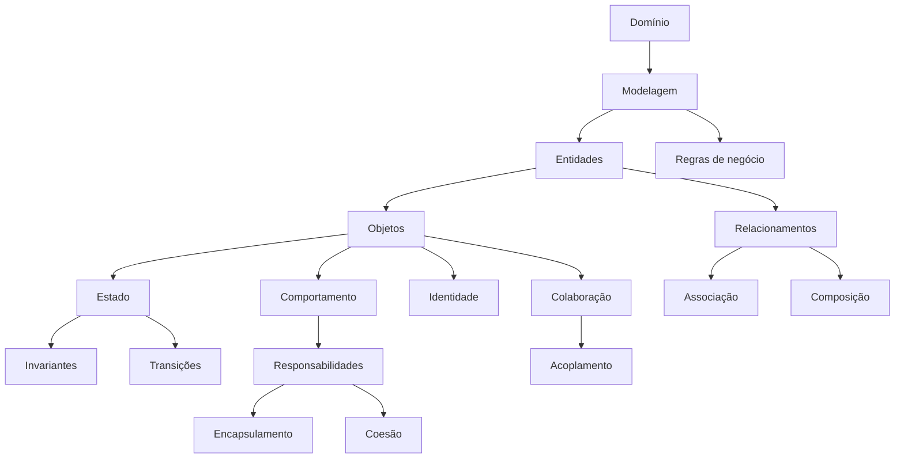

# Mapa de Conhecimento — Módulo 2

> **Do modelo de objetos ao comportamento do domínio**

O Módulo 2 não substitui os conceitos do Módulo 1. Ele os amplia: objetos passam a proteger seu próprio estado, manter invariantes e colaborar para realizar um fluxo de negócio completo.

## O que foi acrescentado

### Fundamentos de POO

- **Objeto rico** — objeto que concentra dados, comportamento e regras relacionadas ao conceito que representa.

    Por exemplo, em vez de espalhar pelo sistema regras sobre o preço de um produto, o próprio Produto pode possuir operações responsáveis por alterar seu preço de acordo com as regras do domínio.

    O objeto, portanto, não é apenas uma “lista de atributos”. Ele possui conhecimento e comportamento relacionados àquilo que representa.

- **Objeto anêmico** — objeto que possui apenas dados, sem comportamento ou regras relacionadas ao conceito que representa.

    Por exemplo, um Produto que apenas possui atributos como nome, preço e estoque, mas não possui operações para alterar seu preço de acordo com as regras do domínio.

    O objeto anêmico é considerado um antipadrão, pois espalha regras pelo sistema e não protege seu próprio estado.

- **Invariante** — condição que deve permanecer verdadeira para que o objeto esteja em estado válido. Exemplos:

    - preço não pode ser negativo;
    - quantidade de um item deve ser positiva;
    - pedido entregue não pode voltar para criado;
    - determinada transição de pedido não pode ocorrer antes de outra.

    As invariantes são importantes porque transformam regras do domínio em garantias do próprio objeto. Uma classe bem projetada não depende de todo o restante do sistema “lembrar” de suas regras.

- **Estado e transição de estado** — um objeto pode possuir estados distintos e regras que determinam quais transições são permitidas. Uma transição de estado é a mudança de um estado válido para outro. Por exemplo:

    ```
    CRIADO → PAGO
    PAGO → ENVIADO
    ENVIADO → ENTREGUE
    ```

    Nem toda mudança é válida. Por isso, estado deve ser entendido como parte do comportamento do objeto, e não simplesmente como uma string armazenada.

- **Imutabilidade** — quando o estado relevante de um objeto ou valor não pode ser alterado depois de criado. Por exemplo, ItemPedido é tratado de maneira diferente de ItemCarrinho porque representa uma compra já concretizada. Essa diferença é importante:

    - ItemCarrinho: pode ser alterado enquanto a compra está sendo construída
    - ItemPedido: representa o registro da compra realizada

    A imutabilidade pode ser utilizada como mecanismo para preservar decisões já tomadas pelo sistema.


### Modelagem de domínio

- **Regra de negócio** — é uma condição ou comportamento definido pelo domínio da aplicação. Exemplos:

    - um carrinho vazio não pode ser finalizado;
    - determinado desconto depende do tipo de cliente;
    - um cupom possui validade;
    - um pedido não pode sofrer determinadas transições;
    - frete pode ser gratuito acima de determinado valor.

    Uma boa modelagem procura colocar essas regras próximas dos conceitos responsáveis por garanti-las.

- **Estado do domínio** — situação em que uma entidade se encontra e que influencia o que ela pode fazer.

### Design de objetos

- **Colaboração entre objetos** — objetos trabalham juntos para realizar uma operação maior.
- **Distribuição de responsabilidades** — o fluxo deixa de pertencer a uma única classe e passa a ser dividido entre objetos que possuem responsabilidades coerentes.

### Qualidade do design

Esses dois itens agora ganham importância maior, pois a colaboração entre objetos passa a ser mais complexa:

- **Coesão** representa o quanto as responsabilidades de um módulo, classe ou componente estão relacionadas entre si. Uma classe com alta coesão possui responsabilidades que fazem sentido juntas.

    Uma classe que cadastra usuários, calcula impostos, envia e-mails e gera relatórios provavelmente possui responsabilidades demais. Alta coesão significa, em termos práticos:

    > responsabilidades que pertencem juntas devem permanecer juntas.

- **Acoplamento** representa o grau de dependência entre elementos do software.

    Quando uma classe conhece diretamente muitas outras classes concretas e depende de seus detalhes, seu acoplamento aumenta.

## O mapa acumulado



## Uma ideia importante

Com o avanço dos conceitos, encapsulamento ganha um significado mais forte:

> **O próprio objeto deve proteger as regras que garantem que seu estado permaneça válido.**

Isso leva naturalmente à pergunta:

> Se diferentes objetos precisam colaborar, como distribuímos essas responsabilidades sem criar dependências desnecessárias?

Essa pergunta prepara o terreno para o Módulo 3.

## O que já sabemos fazer

```text
Modelar o domínio
      ↓
Criar objetos com responsabilidades
      ↓
Proteger invariantes
      ↓
Representar estados
      ↓
Fazer objetos colaborarem
      ↓
Realizar um fluxo de negócio
```

## Próximo passo

No Módulo 3, o problema muda: o sistema funciona, mas algumas regras começam a **variar**. Vamos precisar de abstrações e polimorfismo para representar essas variações.

[Ver o Mapa Geral de Conceitos](../mapa-conceitos.md)
