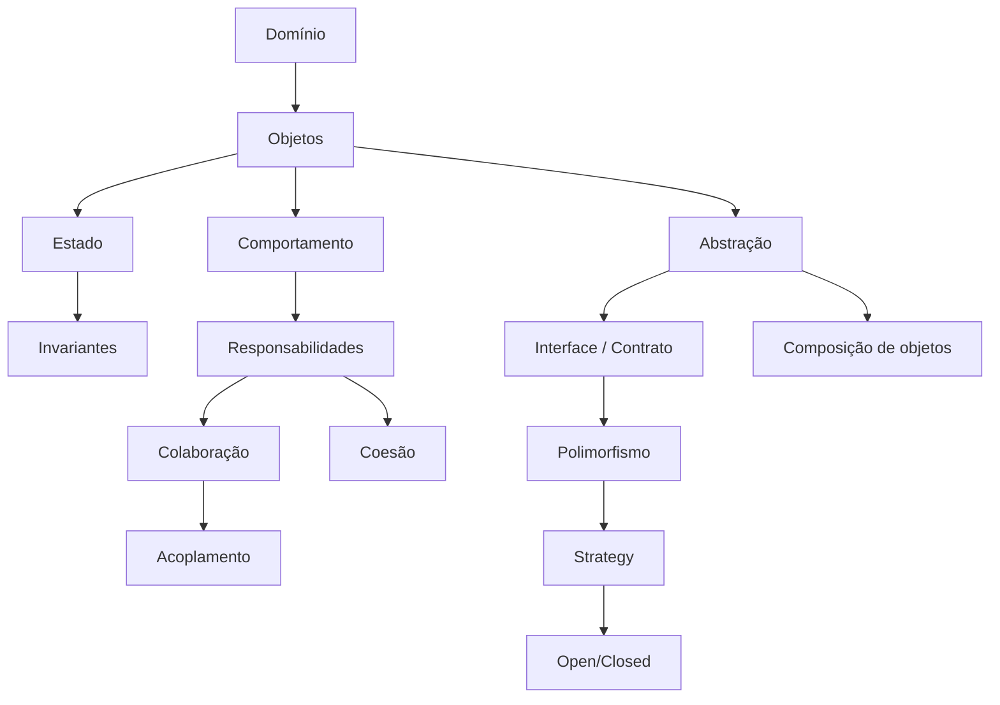

# Mapa de Conhecimento — Módulo 3

> **Da colaboração à variação de comportamento**

No Módulo 3 aparece uma nova necessidade: o mesmo problema pode possuir diferentes formas de ser resolvido. O foco passa a ser **como representar variações sem espalhar condicionais pelo sistema**.

## O que foi acrescentado

### Design de objetos

- **Abstração** — consiste em representar aquilo que é relevante para um determinado contexto, ocultando detalhes que não precisam ser conhecidos por quem utiliza a abstração. 

      Por exemplo, o Pedido não precisa conhecer todos os detalhes de como um pagamento via Pix é processado. Ele pode trabalhar com uma abstração de pagamento.

      A abstração permite que o código dependa de um conceito mais geral, em vez de depender diretamente de uma implementação específica.
      
- **Interface** — contrato que define operações esperadas por diferentes implementações. Em resumo, é um contrato que define quais operações uma implementação deve oferecer.

      Ela descreve `o que` pode ser feito, mas não `como` é feito. Quem utiliza a interface depende apenas do contrato, e não das implementações concretas.
      
      Por exemplo:

      ```
      EstrategiaDesconto
        │
        ├── SemDesconto
        └── DescontoPercentual
      ```

      Quem utiliza EstrategiaDesconto não precisa conhecer os detalhes de cada implementação.

- **Contrato** — conjunto de expectativas que uma abstração estabelece para seus consumidores. Uma interface pode estabelecer, por exemplo:

      - que uma operação deve receber determinado parâmetro;
      - que uma operação deve retornar determinado tipo de resultado;
      - que uma operação deve lançar determinada exceção em caso de erro.

      Por exemplo, a interface EstrategiaDesconto pode estabelecer o contrato:

      > calcular(total) → valor

      Qualquer implementação do contrato deve respeitar essa expectativa. O contrato não é apenas a assinatura de um método. Ele também envolve o comportamento esperado.

- **Polimorfismo** — é a capacidade de diferentes objetos serem tratados por meio de uma mesma abstração e responderem à mesma operação de acordo com suas próprias implementações. Por exemplo:

      > estrategia.calcular(total)

      pode ser executado sobre diferentes estratégias. O código que chama calcular() não precisa conhecer qual implementação concreta está sendo utilizada. 

      Esse é um dos mecanismos fundamentais que tornam o padrão Strategy possível.

### Qualidade do design

- **Variação isolada** — regras que variam devem, quando possível, ser isoladas das partes que permanecem estáveis.
- **Baixo acoplamento** passa a ser obtido também por meio de abstrações, em vez de dependências diretas de implementações concretas.

### SOLID

- **Open/Closed Principle (OCP)** — afirma que entidades de software devem estar abertas para extensão, mas fechadas para modificações desnecessárias.

      Na prática, isso significa procurar estruturas nas quais seja possível adicionar novos comportamentos sem precisar alterar constantemente código existente e já testado.

      O `Strategy` demonstrou isso claramente. Para adicionar uma nova estratégia de desconto, podemos criar uma nova implementação do contrato em vez de aumentar indefinidamente um if/elif dentro de Pedido.

O restante do SOLID será consolidado posteriormente; aqui o princípio surge a partir de um problema concreto.

### Design Patterns

- **Strategy** — é um padrão de projeto que permite encapsular diferentes algoritmos ou regras intercambiáveis em objetos separados.

      A estrutura geral é:

      ```
                  Estratégia
                        │
            ┌──────────┴──────────┐
            ↓                     ↓
      Estratégia A          Estratégia B
      ```

      O objeto consumidor recebe ou utiliza uma estratégia sem precisar conhecer seus detalhes. Na prática, fizemos algo assim:

      ```
      EstrategiaDesconto
      ├── SemDesconto
      └── DescontoPercentual
      ```

      e:

      ```
      EstrategiaFrete
       ├── FreteFixo
       └── FreteGratisAcimaDe
      ```

      O mesmo formato estrutural foi utilizado para problemas de negócio diferentes.


## O mapa acumulado



## A pergunta central do módulo

> **Como representar uma regra que varia sem fazer o objeto principal conhecer todas as suas implementações?**

A resposta estudada foi a combinação de:

```text
Abstração
   ↓
Contrato
   ↓
Implementações diferentes
   ↓
Polimorfismo
   ↓
Strategy
```

## O que mudou na forma de pensar

Antes, o foco estava principalmente em distribuir responsabilidades.

Agora surge uma preocupação adicional:

> **O que deve permanecer estável e o que pode variar?**

Essa distinção será importante no Módulo 4, quando a variação deixa de estar apenas no comportamento e passa a aparecer também na **criação de objetos**.

[Ver o Mapa Geral de Conceitos](../mapa-conceitos.md)
