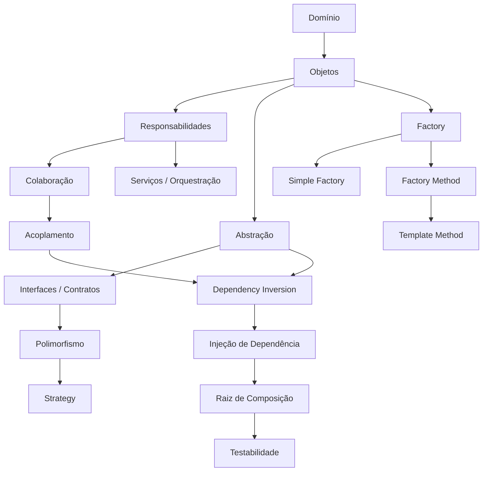

# Mapa de Conhecimento — Módulo 4

> **Da variação de comportamento ao controle das dependências**

O Módulo 4 leva a mesma preocupação do Módulo 3 para outro lugar. Antes isolamos a variação de comportamento. Agora isolamos a **criação de objetos** e, ao final, a própria montagem das dependências.

## O que foi acrescentado

### Design Patterns — criação

- **Factory** — é um padrão de projeto que concentra a criação de objetos em um ponto específico, evitando que o código dependa diretamente de implementações concretas. O Factory pode ser simples ou complexo, dependendo do contexto.

    Uma Factory encapsula a decisão sobre qual implementação concreta deve ser instanciada. A vantagem não é simplesmente “ter uma classe para chamar o construtor”, mas isolar a decisão de criação.

    Em vez de:

    ```
    Pedido
    ├── conhece PagamentoPix
    ├── conhece PagamentoBoleto
    └── conhece PagamentoCartao
    ```

    temos:

    ```
    Pedido
       ↓
    CriadorPagamento
       ↓
    Pagamento concreto
    ```

- **Simple Factory** —  concentra em um ponto a criação de objetos quando a escolha depende de algum dado ou parâmetro. Por exemplo:

    ```
    FormaPagamento.PIX
            ↓
    PagamentoPix
    ```

    A decisão pode ser feita por um enum, uma configuração ou outro identificador. A ideia principal é que o código consumidor não precise conhecer os construtores das implementações concretas.

    É importante ressaltar que a Simple Factory não é um padrão formal da literatura. Ela é uma técnica que aparece com frequência e, por isso, merece atenção.

- **Factory Method** — é um padrão no qual uma classe-base define um método responsável pela criação, mas delega às subclasses a decisão sobre qual objeto concreto criar.

    Estrutura conceitual:

    ```
    Expedidor
       │
       ├── despachar()
       │       ↓
       │   criar_entrega()
       │
       ├── ExpedidorLojaCentral
       └── ExpedidorCentroRegional
    ```

    O fluxo geral permanece na classe-base, enquanto a criação específica varia nas subclasses.

- **Template Method** —  define um fluxo geral em uma classe-base e deixa determinadas etapas variáveis para as subclasses.

    Por exemplo, o fluxo de pagamento pode ser:

    ```
    confirmar()
       ↓
    verificar situação
       ↓
    processar()
    ```

    A parte comum permanece na classe-base. A parte específica é delegada à implementação concreta. O padrão permite preservar uma sequência geral enquanto algumas etapas podem variar.

### Dependências e composição

- **Dependência** — relação em que um elemento precisa de outro para realizar seu trabalho.
- **Dependência concreta** — dependência direta de uma implementação específica.
- **Injeção de Dependência** — é uma técnica na qual um objeto recebe de fora as dependências que precisa utilizar.

    Sem injeção:

    ```
    Pedido
      ↓
    cria CriadorPagamento
    ```

    Com injeção:

    ```
    CriadorPagamento
      ↓
    Pedido
    ```

    O Pedido não precisa decidir qual implementação concreta utilizar. Isso reduz acoplamento e torna o objeto mais fácil de testar e substituir.

- **Formas de injeção** — Uma dependência pode ser fornecida de diferentes maneiras.
    - **Injeção por construtor**: a dependência é fornecida quando o objeto é criado. É geralmente a forma preferida quando a dependência é necessária para o funcionamento do objeto.
    - **Injeção por método**: a dependência é fornecida apenas para determinada operação. É útil quando a dependência varia conforme a chamada.
    - **Injeção por setter**: a dependência é fornecida por meio de um método específico. Pode ser útil quando a dependência é opcional ou pode ser alterada durante a vida do objeto.

- **Raiz de composição** — ponto responsável por montar o grafo de objetos e suas dependências. Em vez de cada classe criar seus próprios colaboradores:

    - Pedido cria Factory
    - Factory cria Pagamento
    - Serviço cria Notificação
    - ...

    Com isso, temos um ponto de montagem:

    ```
    Raiz de composição
           │
           ├── Pedido
           ├── CriadorPagamento
           ├── Expedidor
           └── ServiçoNotificacao
    ```

    A partir desse ponto, os objetos recebem aquilo de que precisam. Isso torna mais simples substituir implementações e configurar diferentes ambientes ou cenários de teste.

- **Serviço de aplicação/orquestração** — coordena operações que envolvem vários objetos sem concentrar todas as regras em uma única entidade.

    Nem toda responsabilidade pertence a uma entidade do domínio. Quando existe uma sequência que coordena várias entidades e colaboradores, pode fazer sentido criar um serviço responsável pela orquestração.

    Por exemplo, vimos o `ServicoPedido`, que coordena operações como:

    ```
    pagar
      ↓
    notificar

    despachar
      ↓
    notificar
    ```

    A entidade Pedido continua responsável pelas regras próprias do pedido, enquanto o serviço coordena a colaboração entre vários objetos.

### SOLID

O módulo torna mais concreto o **Dependency Inversion Principle (DIP)**:

> módulos de alto nível não devem ficar presos a detalhes concretos; ambos devem depender de abstrações.

Também reforça o **Open/Closed Principle**, a separação de responsabilidades e a busca por baixo acoplamento.

## O mapa acumulado



## A pergunta central do módulo

> **Quem deve criar e montar os objetos que colaboram entre si?**

A resposta final do módulo é:

```text
Objetos não precisam criar suas próprias dependências.

                 ↓

As dependências podem ser fornecidas externamente.

                 ↓

Um ponto de composição monta o grafo de objetos.
```

## Onde chegamos

A evolução conceitual dos quatro módulos pode ser resumida assim:

```text
Módulo 1
Modelar conceitos e responsabilidades
        ↓
Módulo 2
Proteger estado e coordenar comportamentos
        ↓
Módulo 3
Isolar variações de comportamento
        ↓
Módulo 4
Isolar criação e montagem de dependências
```

Este é o ponto em que os conceitos deixam de aparecer como técnicas isoladas e começam a formar um **design orientado a objetos coerente**.

## Próximo passo

Antes de avançar para o próximo módulo, vale fazer uma pausa e olhar o percurso completo.

[Mapa Geral de Conceitos de POO II](../mapa-conceitos.md)
